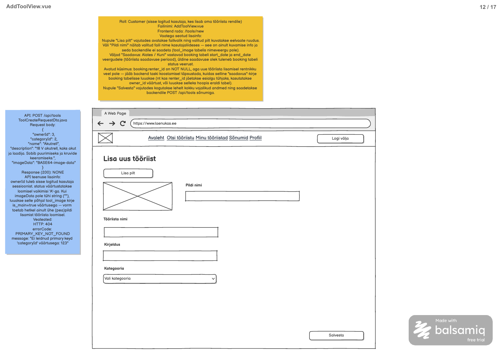

# Tööriista lisamine

**Teenus:** `POST /api/tools`

**Vaste balsamic mockupis:** AddToolView.vue, lehekülg 12/17 failis [Laenukas 2509.pdf](../../../balsamic/notes/Laenukas%202509.pdf).



**Kasutaja kinnitatud täpsustus:** kollase märkuse saadavuse perioodi osa on aegunud. Alates/Kuni välju ega booking-kirjet ei looda; tööriista algstaatus on A. See asendab sama aegunud osa [AddToolView märkmetes](../../../balsamic/notes/AddToolView-markmed.md). API näite ownerId jäetakse request'ist välja, sest nii PDF-i teenuse selgitus kui OAuth leping määravad omaniku serveri sessioonist.

## Sisend ja väljund

### `POST /api/tools`

Autenditud Customer, kelle profiil on täidetud. Path/query parameetrid puuduvad. `ToolCreateRequestDto.java` — request body:

```json
{
  "categoryId": 2,
  "name": "Akutrell",
  "description": "18 V akutrell, kaks akut ja laadija. Sobib puurimiseks ja kruvide keeramiseks.",
  "imageData": ""
}
```

Näide kasutab PDF-i tööriistaandmeid ja pildita loomise lubatud varianti. Pildiga variandis sisaldab imageData tegelike pildibaitide Base64 esitust ilma data-URL prefiksita; `BASE64-image-data` PDF-is on kohatäitja, mitte kehtiv kodeering.

| Väli | Java tüüp | Reegel |
|---|---|---|
| categoryId | Integer | Kohustuslik positiivne ja olemasolev kategooria ID. |
| name | String | Kohustuslik mittetühi nimi, kuni 150 märki. |
| description | String | Valikuline, kuni 2000 märki; puuduv/null lubatud. |
| imageData | String | Valikuline ühe pildi Base64; tühi, puuduv või null tähendab pildita tööriista (null/puudumine on tehniline täpsustus). |

**Response (200 OK):** tühi body, DTO-d ega uut toolId-d ei tagastata. ownerId, status, kuupäevad, pildi failinimi ja isMain ei kuulu request DTO-sse. Omanik määratakse sessiooni userId järgi, status serveris A. Pilt salvestatakse olemasolul is_main=true väärtusega.

## Eesmärk ja ärireeglid

Customer lisab enda tööriista, et see ilmuks otsingusse ja Minu tööriistad loendisse. Loomine ei ole broneerimine ega vaja rentijat.

1. Tuvasta omanik sessioonist, kontrolli Customer rolli ja profiili olemasolu. Ära usalda kliendi võimalikku ownerId lisavälja; see ei tohi muuta salvestatavat omanikku.
2. Valideeri request, leia kategooria. Kategooria nimi ei pea olema request'is, tööriista nimi ei pea olema unikaalne.
3. Pildi olemasolul dekodeeri Base64 üks kord baitideks; `StringBytesConverter.stringToBytes()` ei ole Base64 dekooder. Vigane kodeering annab 400, mitte osaliselt salvestatud tööriista. Valideerimine peab toimuma enne kirje loomist.
4. Salvesta ühes transaktsioonis tool ja vajadusel üks tool_image: owner_id sessioonist, category_id request'ist, nimi/kirjeldus request'ist, status A ning loodud ajatemplid. Pildil is_main=true. Pildita loomine ei lisa tool_image rida.
5. Tagasta 200 tühja body'ga; vea korral kogu salvestus tagasi. booking, profiili aadress ja kategooria andmed ei muutu. E-kirja ega kalendrisündmust ei saadeta.

**Pildilepingu lahtised detailid:** PDF ei määra lubatud failiformaate ega mahu/piikslite ülempiiri. Skeemis puudub MIME-väli; olemasolev loendi API tagastab ainult Base64. Enne üleslaadimise lõplikku teostamist tuleb kokku leppida formaadid, MIME tuvastamine kuvamisel ja ühtne serveri/FE suurusepiir. Task ei mõtle neid väärtusi välja ega lisa skeemile MIME-veergu. Base64 korrektne dekodeerimine üksi ei tõenda, et fail on toetatud pilt.

## Seotud andmebaasi tabelid

### `tool`

```sql
CREATE TABLE tool (
    id serial PRIMARY KEY,
    owner_id integer NOT NULL REFERENCES app_user (id),
    category_id integer NOT NULL REFERENCES category (id),
    name varchar(150) NOT NULL,
    description varchar(2000),
    status char(1) NOT NULL DEFAULT 'A' CHECK (status IN ('A', 'U')),
    created_at timestamp NOT NULL DEFAULT current_timestamp,
    updated_at timestamp NOT NULL DEFAULT current_timestamp
);
```

### `tool_image`

```sql
CREATE TABLE tool_image (
    id serial PRIMARY KEY,
    tool_id integer NOT NULL REFERENCES tool (id) ON DELETE CASCADE,
    image_data bytea NOT NULL,
    is_main boolean NOT NULL DEFAULT false,
    CONSTRAINT tool_image_data_unique UNIQUE (tool_id, image_data)
);
```

### `category`

```sql
CREATE TABLE category (
    id serial PRIMARY KEY,
    category_name varchar(100) NOT NULL UNIQUE,
    description varchar(255),
    sequence integer NOT NULL
);
```

Vt [2_create.sql](../../../database/2_create.sql). tool.owner_id viitab app_user.id-le, category_id kategooriale; profiili olemasolu kontrollitakse profile.user_id kaudu. tool_image seos on FK ON DELETE CASCADE, peapildi osaline unikaalne indeks lubab tööriistal ühe is_main=true kirje. Failinime veergu pole.

[3_import.sql](../../../database/3_import.sql) näites on Customer Liis Kask ID-ga 3 ja profiiliga 3, kategooria 2 „Ehitustööd“. Request'i Akutrelli nimi võib korduda; olemasolev tool 1 ei kirjutata üle, uue ID annab andmebaas. Omanikuks saab 3 ainult juhul, kui sessioon kuulub Liisile.

## Veaolukorrad

| Status code | errorCode | message | Frontend käitumine |
|---|---|---|---|
| 401 | — | Tühi body | Ühine aegunud sessiooni käsitlus; vorm ei näita edukat salvestust. |
| 403 | — | Tühi body, roll pole customer või CSRF kontroll ebaõnnestus | Üldine ligipääsu/sessiooni viga; ära eelda profiili puudumist. |
| 400 | INCORRECT_INPUT | <väli>: <valideerimise teade> | Kuva message ja säilita sisestatud väärtused. |
| 400 | INCORRECT_INPUT | imageData: peab olema korrektne Base64 | Kuva message ja säilita sisestatud väärtused. |
| 403 | PROFILE_REQUIRED | Tööriista lisamiseks täida oma profiil. | Kuva message ja säilita sisestatud väärtused. |
| 404 | PRIMARY_KEY_NOT_FOUND | Ei leidnud primary keyd 'categoryId' väärtusega: 123 | Kuva message ja säilita sisestatud väärtused. |
| 500 | INTERNAL_SERVER_ERROR | Tööriista lisamine ebaõnnestus. Palun proovi hiljem uuesti. | Kuva message ja säilita sisestatud väärtused. |

```json
{
  "errorCode": "INCORRECT_INPUT",
  "message": "<väli>: <valideerimise teade>"
}
```

```json
{
  "errorCode": "INCORRECT_INPUT",
  "message": "imageData: peab olema korrektne Base64"
}
```

```json
{
  "errorCode": "PROFILE_REQUIRED",
  "message": "Tööriista lisamiseks täida oma profiil."
}
```

```json
{
  "errorCode": "PRIMARY_KEY_NOT_FOUND",
  "message": "Ei leidnud primary keyd 'categoryId' väärtusega: 123"
}
```

```json
{
  "errorCode": "INTERNAL_SERVER_ERROR",
  "message": "Tööriista lisamine ebaõnnestus. Palun proovi hiljem uuesti."
}
```

404 pärineb PDF-ist. Valideerimise ja 500 sõnastused on taski tehnilised täpsustused. PROFILE_REQUIRED konkretiseerib Google juhendi nõude, et tööriista ei lisata enne profiili täitmist. Role Customer tuleneb AddToolView märkmetest; Adminile ligipääsu laiendamist see task ei lisa. HTTP 403 äriviga eristatakse tühja body'ga autentimis-/CSRF veast.

## Vastuvõtu kriteeriumid

- [ ] Customer saab lisada tööriista; autentimata ja muu rolliga päringud on piiratud.
- [ ] Omanik tuleb sessioonist, status on A, ID genereeritakse; vastus 200 tühja body'ga.
- [ ] Profiilita konto saab PROFILE_REQUIRED; olemasoleva profiiliga konto saab jätkata.
- [ ] Pildita request loob ainult tool kirje; pildiga loob ühe peapildi tegelike dekodeeritud baitidega.
- [ ] Puuduv kategooria, vigased väljad ja vigane Base64 tagastavad kirjeldatud vead ilma uue tool kirjeta.
- [ ] Nime 150 ja kirjelduse 2000 märgi piirid on kontrollitud; valikuline kirjeldus/pilt võib puududa.
- [ ] Pildi salvestamise tõrge rullib tagasi ka tool kirje; SQL-i ega stack trace'i ei tagastata kliendile.
- [ ] booking-kirjet ega saadavuse kuupäevi ei looda, teiste kasutajate andmed ei muutu.
- [ ] Automaattestid katavad rolli/sessiooni omaniku, võõra ownerId, profiilinõude, pildiga/pildita loomise, piirväärtused, Base64, 404 ja rollback'i.
- [ ] Pildiformaadid ning FE/BE mahu- ja kuvamisleping on enne pildifunktsiooni lõplikku teostamist täpsustatud.
