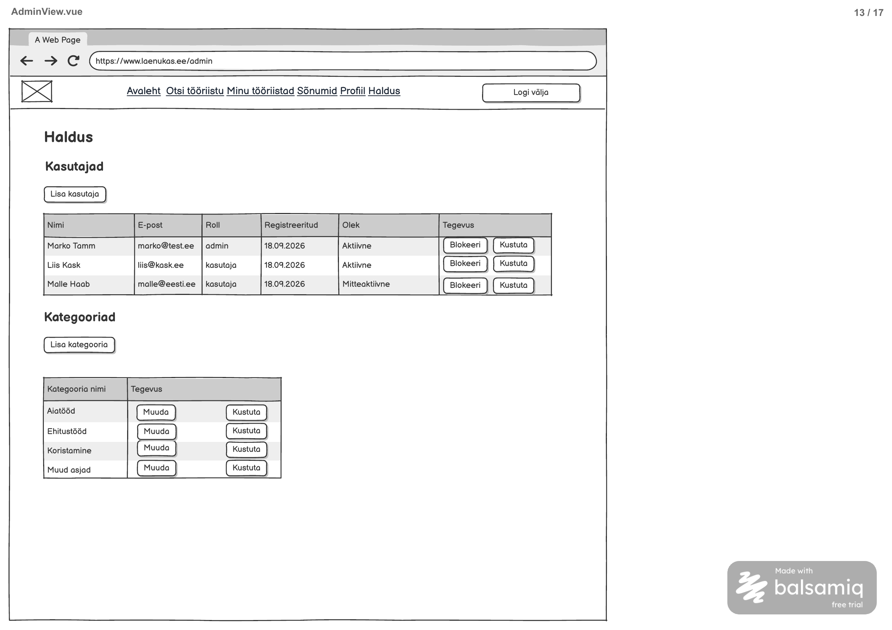

# Kasutaja blokeerimine

**Teenus:** `PATCH /api/admin/users/{userId}/status`

**Vaste balsamic mockupis:** AdminView.vue (eraldi STEP-tähis puudub), lehekülg 13/17 failis [Laenukas.pdf](../../../balsamic/notes/Laenukas.pdf) (vt `Kasutaja-blokeerimine.png`).



Täiendav allikas: [AdminView märkmed](../../../balsamic/notes/AdminView-markmed.md). Task kirjeldab backend'i teenust, mitte Vue vaate teostust.

## Sisend

| Parameeter | Asukoht | Java tüüp | Kohustuslik | Tähendus |
|---|---|---|---|---|
| `userId` | Path variable | `Integer` | Jah | Muudetava kasutaja `app_user.id`. |
| `status` | Request body | `String` | Jah | Uus olek: `B` (blokeeri) või `A` (aktiivne). |

Request body (`UserStatusRequestDto.java`), näide `PATCH /api/admin/users/3/status`:

```json
{
  "status": "B"
}
```

Mockupi nupp „Blokeeri“ saadab alati `"B"`. Teenus lubab ka väärtust `"A"`, sest andmebaas lubab ainult olekuid `A` ja `B`. Muu väärtus on valideerimisviga.

Teenus on ainult adminile (`/api/admin/**`, `hasRole("admin")`).

## Väljund

**Response (200 OK):** tühi body (`Response (200): NONE`).

Teenus seab `app_user.status` väärtuseks request'i `status`. Kui kasutajal on juba sama olek, vastatakse samuti 200 (operatsioon on idempotentne). Blokeeritud kasutaja ei saa enam sisse logida: `CustomOAuth2UserService` kontrollib `status = 'B'` (vt [googlega_login.md](../../../balsamic/notes/googlega_login.md)). Vaates kuvatakse olekut `B` tekstina „Mitteaktiivne“.

## Eesmärk

Teenust kasutab AdminView tabeli „Kasutajad“ nupp „Blokeeri“. Admin saab probleemse kasutaja süsteemist välja lukustada ilma tema andmeid (tööriistu, broneeringuid) kustutamata. Pärast edukat vastust laadib vaade kasutajate tabeli uuesti (`GET /api/admin/users`).

## Seotud andmebaasi tabelid

Vt [2_create.sql](../../../database/2_create.sql).

### `app_user`

```sql
CREATE TABLE app_user (
    id serial PRIMARY KEY,
    role_id integer NOT NULL REFERENCES role (id),
    first_name varchar(100) NOT NULL,
    last_name varchar(100) NOT NULL,
    google_sub varchar(255) NOT NULL UNIQUE,
    status char(1) NOT NULL DEFAULT 'A' CHECK (status IN ('A', 'B'))
);
```

Muudetakse ainult veergu `status`. `CHECK` piirang lubab väärtusi `A` ja `B`.

Algandmed failist [3_import.sql](../../../database/3_import.sql):

| app_user.id | Nimi | Roll | status |
|---|---|---|---|
| 1 | Marko Tamm | admin | A |
| 3 | Liis Kask | customer | A |

`profile`, `tool` ja `booking` ei muutu.

## Veaolukorrad

Vastuse kuju on olemasolev `ApiError` (`message`, `errorCode`).

| Olukord | Status code | Response body |
|---|---|---|
| Kasutaja pole sisse logitud. | 401 Unauthorized | tühi (Spring Security) |
| Sisse logitud kasutaja roll pole `admin`. | 403 Forbidden | tühi (Spring Security) |
| Kasutajat `userId = 123` pole. Teates kasutada tegelikku väärtust. | 404 Not Found | `{"errorCode":"PRIMARY_KEY_NOT_FOUND","message":"Ei leidnud primary keyd 'userId' väärtusega: 123"}` |
| Admin üritab blokeerida iseennast (`userId` = sisse logitud kasutaja ID) ja `status = "B"`. | 403 Forbidden | `{"errorCode":"SELF_BLOCK_NOT_ALLOWED","message":"Iseennast ei saa blokeerida"}` |
| `status` puudub või pole `A`/`B`. | 400 Bad Request | `{"errorCode":"INCORRECT_INPUT","message":"status: <valideerimise teade>"}` |
| Andmebaasipäring ebaõnnestub ootamatult. | 500 Internal Server Error | `{"errorCode":"INTERNAL_SERVER_ERROR","message":"Kasutaja oleku muutmine ebaõnnestus. Palun proovi hiljem uuesti."}` |

- 404 tuleb olemasolevast `PrimaryKeyNotFoundException` klassist.
- `SELF_BLOCK_NOT_ALLOWED` on uus kood. Seda visatakse olemasoleva `ForbiddenException` klassiga.
- 400 tuleb `@Valid` + `@NotNull`/`@Pattern(regexp = "[AB]")` kaudu olemasolevast `handleMethodArgumentNotValid` handlerist.
- Kontrollide järjekord: 400 (valideerimine), 404, siis 403.

## Vastuvõtu kriteeriumid

- [ ] `PATCH /api/admin/users/{userId}/status` on olemas ja kättesaadav ainult `admin` rollile.
- [ ] `{"status":"B"}` kasutajale `userId = 3` annab 200 tühja body'ga ja `app_user.status` on pärast seda `B`.
- [ ] `{"status":"A"}` taastab oleku `A`; sama oleku uuesti saatmine annab samuti 200.
- [ ] Muud `app_user` veerud ega teised tabelid ei muutu.
- [ ] Olematu `userId` annab 404 ja `PRIMARY_KEY_NOT_FOUND` teate päringu ID-ga.
- [ ] Admin ei saa iseennast blokeerida: vastus 403 `SELF_BLOCK_NOT_ALLOWED` ja olek ei muutu.
- [ ] Puuduv või vigane `status` annab 400 `INCORRECT_INPUT`.
- [ ] Sisse logimata kasutaja saab 401 ja mitte-admin 403.
- [ ] Automaattestid katavad eduka blokeerimise ja aktiveerimise, idempotentsuse, 400/403/404/500 juhtumid ning rollipõhise ligipääsu.
