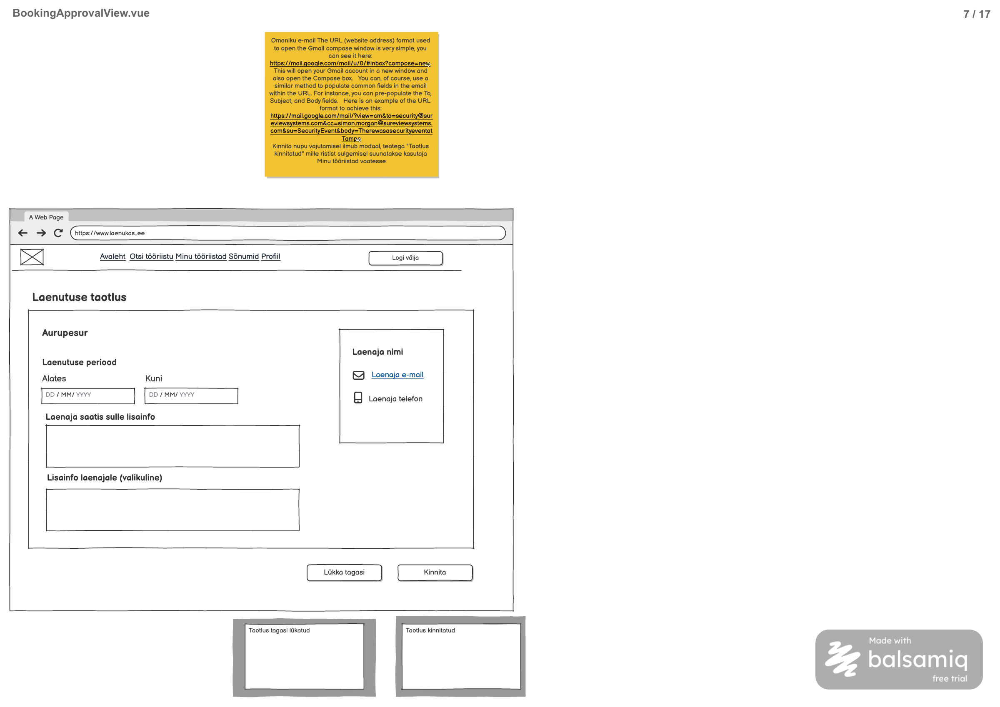

# Broneeringu andmete päring

**Teenus:** `GET /api/bookings/{bookingId}`

**Vaste balsamic mockupis:** BookingApprovalView.vue (eraldi STEP-tähis puudub), lehekülg 7/17 failis [Laenukas.pdf](../../../balsamic/notes/Laenukas.pdf) (vt `Broneeringu-andmete-paring.png`).



Täiendav allikas: [BookingApprovalView märkmed](../../../balsamic/notes/BookingApprovalView-markmed.md). Task kirjeldab backend'i teenust, mitte Vue vaate teostust.

## Sisend

| Parameeter | Asukoht | Java tüüp | Kohustuslik | Tähendus |
|---|---|---|---|---|
| `bookingId` | Path variable | `Integer` | Jah | Vaadatava broneeringu `booking.id`. |

Query parameetrid ja request body puuduvad. Näide: `GET /api/bookings/1`.

Päring nõuab sisselogimist. Kasutaja ID võetakse sessioonist (`@AuthenticationPrincipal AppUserPrincipal`), mitte frontendist. Broneeringut tohivad vaadata ainult tööriista omanik (`tool.owner_id`) ja broneeringu rentija (`booking.renter_id`). Admin roll erandit ei anna.

## Väljund

**Response (200 OK):** `BookingApprovalDto`, broneeringu andmed ja kontaktkaart.

Näide, kui broneeringut `bookingId = 1` vaatab tööriista omanik Marko Tamm (`userId = 1`):

```json
{
  "bookingId": 1,
  "toolId": 1,
  "toolName": "Akutrell",
  "startDate": "2026-10-02",
  "endDate": "2026-10-04",
  "status": "P",
  "ownerMessage": null,
  "isOwner": true,
  "contactName": "Liis Kask",
  "contactEmail": "liis.kask@example.com",
  "contactPhone": "55501002"
}
```

Sama broneering, kui seda vaatab rentija Liis Kask (`userId = 3`):

```json
{
  "bookingId": 1,
  "toolId": 1,
  "toolName": "Akutrell",
  "startDate": "2026-10-02",
  "endDate": "2026-10-04",
  "status": "P",
  "ownerMessage": null,
  "isOwner": false,
  "contactName": "Marko Tamm",
  "contactEmail": "email@Gmail.com",
  "contactPhone": "56565656"
}
```

| Väli | Java tüüp | Allikas | Selgitus |
|---|---|---|---|
| `bookingId` | `Integer` | `booking.id` | |
| `toolId` | `Integer` | `tool.id` | |
| `toolName` | `String` | `tool.name` | Mockupi pealkiri („Aurupesur“ on kohatäitja) |
| `startDate` | `LocalDate` | `booking.start_date` | kuju `yyyy-MM-dd` |
| `endDate` | `LocalDate` | `booking.end_date` | kuju `yyyy-MM-dd` |
| `status` | `String` | `booking.status` | `P` = ootel, `C` = kinnitatud, `R` = tagasi lükatud |
| `ownerMessage` | `String` | `booking.owner_message` | Ootel taotlusel laenaja sõnum, otsustatud taotlusel omaniku vastus; võib olla `null` |
| `isOwner` | `Boolean` | sessiooni kasutaja = `tool.owner_id` | Frontend näitab nuppe ainult siis, kui `isOwner = true` ja `status = "P"` |
| `contactName` | `String` | teise poole `app_user.first_name` + `" "` + `last_name` | Omanikule laenaja, rentijale omanik |
| `contactEmail` | `String` | teise poole `profile.email` | `null`, kui teisel poolel pole profiili |
| `contactPhone` | `String` | teise poole `profile.phone` | `null`, kui teisel poolel pole profiili |

Laenaja sõnum ja omaniku vastus kasutavad sama välja `booking.owner_message` (kasutaja otsus, tabeleid ei muudeta). Päring ei muuda andmeid.

## Eesmärk

Teenus täidab BookingApprovalView vaate (`/bookings/{bookingId}`), mis avatakse omaniku e-kirjast „Vaata taotlust“ või rentija otsusekirjast. Omanik näeb laenutuse taotlust ja laenaja kontakte ning saab taotluse kinnitada või tagasi lükata. Rentija näeb sama infot ainult vaatamiseks koos omaniku kontaktidega. Väli `isOwner` ütleb frontendile, kumba varianti näidata.

## Seotud andmebaasi tabelid

Vt [2_create.sql](../../../database/2_create.sql).

### `booking`

```sql
CREATE TABLE booking (
    id serial PRIMARY KEY,
    tool_id integer NOT NULL REFERENCES tool (id),
    renter_id integer NOT NULL REFERENCES app_user (id),
    start_date date NOT NULL,
    end_date date NOT NULL,
    status char(1) NOT NULL DEFAULT 'P' CHECK (status IN ('P', 'C', 'R')),
    owner_message varchar(500),
    google_event_id varchar(255) UNIQUE,
    created_at timestamp NOT NULL DEFAULT current_timestamp,
    updated_at timestamp NOT NULL DEFAULT current_timestamp,
    CONSTRAINT booking_period_check CHECK (start_date <= end_date)
);
```

### `tool`

```sql
CREATE TABLE tool (
    id serial PRIMARY KEY,
    owner_id integer NOT NULL REFERENCES app_user (id),
    category_id integer NOT NULL REFERENCES category (id),
    name varchar(150) NOT NULL,
    description varchar(2000),
    status char(1) NOT NULL DEFAULT 'A' CHECK (status IN ('A', 'U')),
    created_at timestamp NOT NULL DEFAULT current_timestamp,
    updated_at timestamp NOT NULL DEFAULT current_timestamp
);
```

### `app_user`

```sql
CREATE TABLE app_user (
    id serial PRIMARY KEY,
    role_id integer NOT NULL REFERENCES role (id),
    first_name varchar(100) NOT NULL,
    last_name varchar(100) NOT NULL,
    google_sub varchar(255) NOT NULL UNIQUE,
    status char(1) NOT NULL DEFAULT 'A' CHECK (status IN ('A', 'B'))
);
```

### `profile`

```sql
CREATE TABLE profile (
    id serial PRIMARY KEY,
    user_id integer NOT NULL UNIQUE REFERENCES app_user (id),
    location_id integer NOT NULL REFERENCES location (id),
    email varchar(254) NOT NULL UNIQUE,
    phone varchar(32) NOT NULL,
    created_at timestamp NOT NULL DEFAULT current_timestamp,
    updated_at timestamp NOT NULL DEFAULT current_timestamp
);
```

Profiil on valikuline, seega tuleb teise poole profiili otsida `Optional` tüübiga.

Algandmed failist [3_import.sql](../../../database/3_import.sql):

| booking.id | Tööriist (tool.id) | Omanik | Rentija | Periood | status | owner_message |
|---|---|---|---|---|---|---|
| 1 | Akutrell (1) | Marko Tamm (1) | Liis Kask (3) | 2026-10-02 – 2026-10-04 | P | `NULL` |
| 2 | Redel (2) | Marko Tamm (1) | Liis Kask (3) | 2026-09-18 – 2026-09-21 | C | Palun tagasta redel 21. septembril enne kella 18. |
| 3 | Hekikäärid (4) | Liis Kask (3) | Marko Tamm (1) | 2026-10-05 – 2026-10-07 | R | Soovitud kuupäevadel ei saa tööriista välja laenata. |

| app_user.id | Nimi | profile.email | profile.phone |
|---|---|---|---|
| 1 | Marko Tamm | email@Gmail.com | 56565656 |
| 3 | Liis Kask | liis.kask@example.com | 55501002 |

Impordiandmetes pole kolmandat kasutajat. `BOOKING_ACCESS_DENIED` testiks tuleb luua testikasutaja, kes pole broneeringu omanik ega rentija. `tool_image`, `location` ja `category` ei osale päringus.

## Veaolukorrad

Vastuse kuju on olemasolev `ApiError` (`message`, `errorCode`).

| Olukord | Status code | Response body |
|---|---|---|
| Kasutaja pole sisse logitud. | 401 Unauthorized | tühi (Spring Security) |
| Broneeringut `bookingId = 123` pole. Teates kasutada tegelikku väärtust. | 404 Not Found | `{"errorCode":"PRIMARY_KEY_NOT_FOUND","message":"Ei leidnud primary keyd 'bookingId' väärtusega: 123"}` |
| Sisse logitud kasutaja pole tööriista omanik ega broneeringu rentija. | 403 Forbidden | `{"errorCode":"BOOKING_ACCESS_DENIED","message":"Sul pole õigust seda broneeringut vaadata"}` |
| `bookingId` pole täisarv. | 400 Bad Request | `{"errorCode":"INCORRECT_INPUT","message":"bookingId: peab olema Integer-tüüpi täisarv"}` |
| Andmebaasipäring ebaõnnestub ootamatult. | 500 Internal Server Error | `{"errorCode":"INTERNAL_SERVER_ERROR","message":"Broneeringu laadimine ebaõnnestus. Palun proovi hiljem uuesti."}` |

- 404 tuleb olemasolevast `PrimaryKeyNotFoundException` klassist.
- `BOOKING_ACCESS_DENIED` on uus kood (kinnitatud sildil). Seda visatakse olemasoleva `ForbiddenException` klassiga.
- Kontrollide järjekord: 404, siis 403.
- Path variable'i 400 ja ühtne 500 kuju tuleb teostamisel tagada, sest praegune `RestExceptionHandler` neid automaatselt ei käsitle. SQL-i ega stack trace'i ei tagastata.

## Vastuvõtu kriteeriumid

- [ ] `GET /api/bookings/{bookingId}` on olemas ja nõuab sisselogimist.
- [ ] HTTP 200 vastus sisaldab täpselt välju `bookingId`, `toolId`, `toolName`, `startDate`, `endDate`, `status`, `ownerMessage`, `isOwner`, `contactName`, `contactEmail`, `contactPhone`.
- [ ] Omanik (`userId = 1`) saab `bookingId = 1` puhul `isOwner = true` ja laenaja Liis Kase kontaktid.
- [ ] Rentija (`userId = 3`) saab `bookingId = 1` puhul `isOwner = false` ja omaniku Marko Tamme kontaktid.
- [ ] `ownerMessage` tagastatakse andmebaasi väärtusega, sh `null`.
- [ ] Kui teisel poolel pole profiili, on `contactEmail` ja `contactPhone` `null`, kuid vastus on 200.
- [ ] Kõrvaline kasutaja (ka admin) saab 403 `BOOKING_ACCESS_DENIED`.
- [ ] Olematu `bookingId` annab 404 ja `PRIMARY_KEY_NOT_FOUND` teate päringu ID-ga.
- [ ] Sisse logimata kasutaja saab 401; vigane `bookingId` annab 400 ja andmebaasi tõrge 500.
- [ ] Päring ei muuda andmeid.
- [ ] Automaattestid katavad omaniku ja rentija vaate, profiilita teise poole, `null` sõnumi, 400/401/403/404/500 juhtumid.
