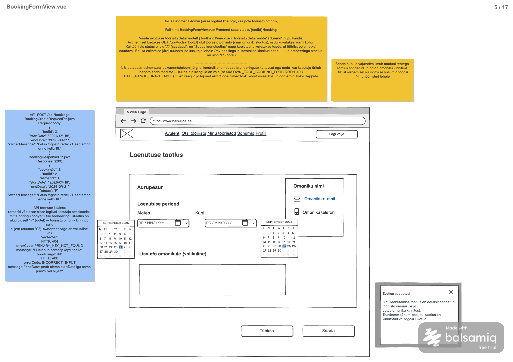

# Laenutuse taotluse loomine

**Teenus:** `POST /api/bookings`

**Vaste balsamic mockupis:** BookingFormView.vue (eraldi STEP-tähis puudub), lehekülg 5/17 failis [Laenukas.pdf](../../../balsamic/notes/Laenukas.pdf) (vt `Laenutuse-taotluse-loomine.png`).



Täiendavad allikad: [BookingFormView märkmed](../../../balsamic/notes/BookingFormView-markmed.md), [Email-new-booking-request märkmed](../../../balsamic/notes/Email-new-booking-request-markmed.md) ja [spring_mail.md](../../../balsamic/notes/spring_mail.md). Task kirjeldab backend'i teenust, mitte Vue vaate teostust.

PDF-i näide (`toolId = 2`, Redel, 18.–21.09.2026) annaks impordiandmetega vea: Redeli staatus on `U` ja periood kattub kinnitatud broneeringuga 2. Seepärast kasutavad silt ja task kehtivat näidet (kasutaja otsus).

## Sisend

Request body (`BookingCreateRequestDto.java`):

| Väli | Java tüüp | Kohustuslik | Reegel |
|---|---|---|---|
| `toolId` | `Integer` | Jah | Olemasoleva tööriista `tool.id` |
| `startDate` | `LocalDate` | Jah | Kuju `yyyy-MM-dd`, täna või tulevikus (`@FutureOrPresent`) |
| `endDate` | `LocalDate` | Jah | Kuju `yyyy-MM-dd`, `endDate >= startDate` |
| `ownerMessage` | `String` | Ei | Laenaja sõnum omanikule, kuni 500 märki, võib olla `null` |

Näide: Liis Kask (`userId = 3`) taotleb Marko Tamme Muruniidukit (`toolId = 5`):

```json
{
  "toolId": 5,
  "startDate": "2026-10-10",
  "endDate": "2026-10-12",
  "ownerMessage": "Sooviksin muruniiduki kätte saada reede õhtul."
}
```

Kuupäevad ja sõnum on näiteväärtused. Tööriist, omanik ja laenaja pärinevad failist `3_import.sql`. Näite kuupäevad jäävad aja jooksul minevikku, seega peavad automaattestid kuupäevad arvutama tänase päeva suhtes (nt `LocalDate.now(clock).plusDays(...)`) või kasutama fikseeritud `Clock`-i.

Päring nõuab sisselogimist. `renterId` võetakse sessioonist (`@AuthenticationPrincipal AppUserPrincipal`), mitte body'st. Lubatud rollid: `customer` ja `admin`.

`ownerMessage` on laenaja sõnum. Sama välja `booking.owner_message` kirjutab omanik hiljem kinnitamisel või tagasilükkamisel üle (kasutaja otsus, tabeleid ei muudeta; vt [BookingApprovalView taskid](../BookingApprovalView/)).

## Väljund

**Response (200 OK):** `BookingResponseDto`, loodud broneering.

```json
{
  "bookingId": 4,
  "toolId": 5,
  "renterId": 3,
  "startDate": "2026-10-10",
  "endDate": "2026-10-12",
  "status": "P",
  "ownerMessage": "Sooviksin muruniiduki kätte saada reede õhtul."
}
```

`bookingId = 4` on impordiandmete järel järgmine `booking_id_seq` väärtus.

Ühes transaktsioonis (`@Transactional`):

1. Lisatakse `booking` rida: `status = 'P'`, `renter_id` sessioonist, `google_event_id = NULL`, `created_at` ja `updated_at` = praegune aeg.
2. Tööriista omanikule saadetakse e-kiri new-booking-request (vt [Email-new-booking-request märkmed](../../../balsamic/notes/Email-new-booking-request-markmed.md)):
   - saaja: omaniku `profile.email`;
   - Reply-To: laenaja `profile.email`;
   - teema: `Uus laenutuse taotlus: <tool.name>`;
   - mall `backend/src/main/resources/templates/email/booking-request.html` andmetega `toolName`, `bookingId`, `renterName`, `startDate`, `endDate`, `bookingUrl` (`{toolrental.frontend-url}/bookings/{bookingId}`).

Kui omanikul pole profiili, kirja ei saadeta ja see logitakse. E-kirja saatmise viga (`MailException`) ainult logitakse: broneering jääb salvestatuks ja vastus on 200.

**Kattumise reegel:** uus taotlus ei tohi kattuda sama tööriista ootel (`P`) ega kinnitatud (`C`) broneeringuga. Perioodid kattuvad, kui olemasoleva broneeringu `start_date <= uus endDate` ja `end_date >= uus startDate`. Tagasi lükatud (`R`) broneering perioodi ei hõiva. Kuna kattumine välistatakse siin, ei pea kinnitamine seda enam kontrollima.

**Alguskuupäeva reegel:** `startDate` peab olema täna või tulevikus (kasutaja otsus). Minevikus algavat taotlust luua ei saa. „Täna“ arvestatakse ajavööndis `Europe/Tallinn`.

## Eesmärk

Teenust kasutab BookingFormView vormi nupp „Saada“. Sisse logitud kasutaja valib teise kasutaja tööriistale laenutuse perioodi ja soovi korral kirjutab omanikule sõnumi. Eduka vastuse järel kuvab vaade modaali „Taotlus saadetud“. Omanik saab e-kirja ja otsustab taotluse üle BookingApprovalView vaates.

## Seotud andmebaasi tabelid

Vt [2_create.sql](../../../database/2_create.sql).

### `booking`

```sql
CREATE TABLE booking (
    id serial PRIMARY KEY,
    tool_id integer NOT NULL REFERENCES tool (id),
    renter_id integer NOT NULL REFERENCES app_user (id),
    start_date date NOT NULL,
    end_date date NOT NULL,
    status char(1) NOT NULL DEFAULT 'P' CHECK (status IN ('P', 'C', 'R')),
    owner_message varchar(500),
    google_event_id varchar(255) UNIQUE,
    created_at timestamp NOT NULL DEFAULT current_timestamp,
    updated_at timestamp NOT NULL DEFAULT current_timestamp,
    CONSTRAINT booking_period_check CHECK (start_date <= end_date)
);
```

Andmebaas kontrollib ainult `start_date <= end_date`. Kattumist ega enda tööriista broneerimist andmebaas ei keela, seega peab need kontrollid tegema service.

### `tool` (ainult lugemine)

```sql
CREATE TABLE tool (
    id serial PRIMARY KEY,
    owner_id integer NOT NULL REFERENCES app_user (id),
    category_id integer NOT NULL REFERENCES category (id),
    name varchar(150) NOT NULL,
    description varchar(2000),
    status char(1) NOT NULL DEFAULT 'A' CHECK (status IN ('A', 'U')),
    created_at timestamp NOT NULL DEFAULT current_timestamp,
    updated_at timestamp NOT NULL DEFAULT current_timestamp
);
```

`owner_id` järgi tehakse enda tööriista kontroll, `status` järgi saadavuse kontroll ja `name` läheb e-kirja.

### `app_user` ja `profile` (ainult lugemine)

`app_user.first_name` on e-kirja `renterName`. `profile.email` annab kirja saaja (omanik) ja Reply-To (laenaja). Profiil on valikuline (`Optional`).

Algandmed failist [3_import.sql](../../../database/3_import.sql):

| tool.id | name | Omanik | status | Aktiivsed broneeringud (P/C) |
|---|---|---|---|---|
| 1 | Akutrell | Marko Tamm (1) | A | booking 1: 2026-10-02 – 2026-10-04, P |
| 2 | Redel | Marko Tamm (1) | U | booking 2: 2026-09-18 – 2026-09-21, C |
| 3 | Tolmuimeja | Liis Kask (3) | A | — |
| 4 | Hekikäärid | Liis Kask (3) | A | — (booking 3 on R) |
| 5 | Muruniiduk | Marko Tamm (1) | A | — |
| 6 | Survepesur | Marko Tamm (1) | A | — |
| 7 | Matkatelk | Marko Tamm (1) | A | — |
| 8 | Projektor | Liis Kask (3) | A | — |

Testiandmete näited:

| Kasutaja | Päring | Tulemus |
|---|---|---|
| Liis (3) | `toolId = 5`, 2026-10-10 – 2026-10-12 | 200, `bookingId = 4` |
| Liis (3) | `toolId = 1`, 2026-10-03 – 2026-10-05 | 403 `TOOL_ALREADY_BOOKED` (kattub bookingiga 1) |
| Liis (3) | `toolId = 1`, 2026-10-05 – 2026-10-06 | 200 (ei kattu) |
| Marko (1) | `toolId = 4`, 2026-10-05 – 2026-10-07 | 200 (booking 3 on R) |
| Liis (3) | `toolId = 2`, mis tahes periood | 403 `TOOL_UNAVAILABLE` |
| Liis (3) | `toolId = 3` | 403 `OWN_TOOL_BOOKING_FORBIDDEN` |

`tool_image`, `category` ja `location` ei osale.

## Veaolukorrad

Vastuse kuju on olemasolev `ApiError` (`message`, `errorCode`).

| Olukord | Status code | Response body |
|---|---|---|
| Kasutaja pole sisse logitud. | 401 Unauthorized | tühi (Spring Security) |
| `endDate` on varasem kui `startDate`. | 400 Bad Request | `{"errorCode":"INCORRECT_INPUT","message":"endDate: peab olema startDate'iga samal päeval või hiljem"}` |
| `startDate` on minevikus. | 400 Bad Request | `{"errorCode":"INCORRECT_INPUT","message":"startDate: ei tohi olla minevikus"}` |
| `toolId`, `startDate` või `endDate` puudub; `ownerMessage` on üle 500 märgi; kuupäeva vorming on vale. | 400 Bad Request | `{"errorCode":"INCORRECT_INPUT","message":"<väli>: <valideerimise teade>"}` |
| Tööriista `toolId = 123` pole. Teates kasutada tegelikku väärtust. | 404 Not Found | `{"errorCode":"PRIMARY_KEY_NOT_FOUND","message":"Ei leidnud primary keyd 'toolId' väärtusega: 123"}` |
| Kasutaja on tööriista omanik (ka admin). | 403 Forbidden | `{"errorCode":"OWN_TOOL_BOOKING_FORBIDDEN","message":"Enda tööriista ei saa laenata"}` |
| Tööriista `status = 'U'`. | 403 Forbidden | `{"errorCode":"TOOL_UNAVAILABLE","message":"Tööriist pole hetkel saadaval"}` |
| Periood kattub sama tööriista `P` või `C` broneeringuga. | 403 Forbidden | `{"errorCode":"TOOL_ALREADY_BOOKED","message":"Tööriist on valitud perioodil juba broneeritud"}` |
| Andmebaasipäring ebaõnnestub ootamatult. | 500 Internal Server Error | `{"errorCode":"INTERNAL_SERVER_ERROR","message":"Laenutuse taotluse saatmine ebaõnnestus. Palun proovi hiljem uuesti."}` |

- 404 tuleb olemasolevast `PrimaryKeyNotFoundException` klassist.
- `OWN_TOOL_BOOKING_FORBIDDEN`, `TOOL_UNAVAILABLE` ja `TOOL_ALREADY_BOOKED` on uued koodid (kinnitatud sildil). Neid visatakse olemasoleva `ForbiddenException` klassiga.
- 400 tuleb `@Valid` kaudu olemasolevast `handleMethodArgumentNotValid` handlerist. See loeb ainult väljavigu (`getFieldErrors().getFirst()`), seega peab `endDate` kontroll tekitama väljavea nimega `endDate`, mitte klassitaseme (global) vea. Muidu handler viskab erindi.
- Kuupäeva vale vorming (`HttpMessageNotReadableException`) ja ühtne 500 kuju tuleb teostamisel eraldi käsitleda; praegune handler neid ei kata.
- Kontrollide järjekord: 400, 404, `OWN_TOOL_BOOKING_FORBIDDEN`, `TOOL_UNAVAILABLE`, siis `TOOL_ALREADY_BOOKED`. Vea korral broneeringut ei looda ja e-kirja ei saadeta.
- E-kirja saatmise viga ei ole veaolukord: see logitakse ja vastus on 200.

## Vastuvõtu kriteeriumid

- [ ] `POST /api/bookings` on olemas ja nõuab sisselogimist.
- [ ] Näites toodud päring (Liis, `toolId = 5`) annab 200 ja `BookingResponseDto` väljadega `bookingId`, `toolId`, `renterId`, `startDate`, `endDate`, `status`, `ownerMessage`.
- [ ] Loodud rea `status = 'P'`, `renter_id` on sessiooni kasutaja ID (body's antud `renterId` ignoreeritakse) ja `google_event_id = NULL`.
- [ ] `ownerMessage: null` või puuduv väli on lubatud.
- [ ] Omanikule saadetakse e-kiri teemaga `Uus laenutuse taotlus: Muruniiduk`, saajaks `email@Gmail.com`, Reply-To `liis.kask@example.com` ja lingiga `/bookings/4`.
- [ ] Omaniku profiili puudumisel või `MailException` korral on vastus ikka 200 ja broneering salvestatud; viga logitakse.
- [ ] Kattuv `P` või `C` broneering annab 403 `TOOL_ALREADY_BOOKED`; `R` broneering ja piiriga mittekattuv periood ei takista.
- [ ] Enda tööriist annab 403 `OWN_TOOL_BOOKING_FORBIDDEN`; `status = 'U'` tööriist 403 `TOOL_UNAVAILABLE`.
- [ ] Olematu `toolId` annab 404; `endDate < startDate` ja muud valideerimisvead annavad 400.
- [ ] Minevikus algav `startDate` annab 400 teatega `startDate: ei tohi olla minevikus`; täna algav periood on lubatud.
- [ ] Vea korral broneeringut ei looda ja e-kirja ei saadeta.
- [ ] Automaattestid (e-kirja saatmine `JavaMailSender` mockiga) katavad eduka loomise, kõik testiandmete näited, kattumise piirjuhud (sama algus- või lõpupäev), alguskuupäeva piirjuhud (eile, täna, homme), kirja sisu ja saajad, profiilita omaniku, kirja saatmise vea ning 400/401/403/404/500 juhtumid.
