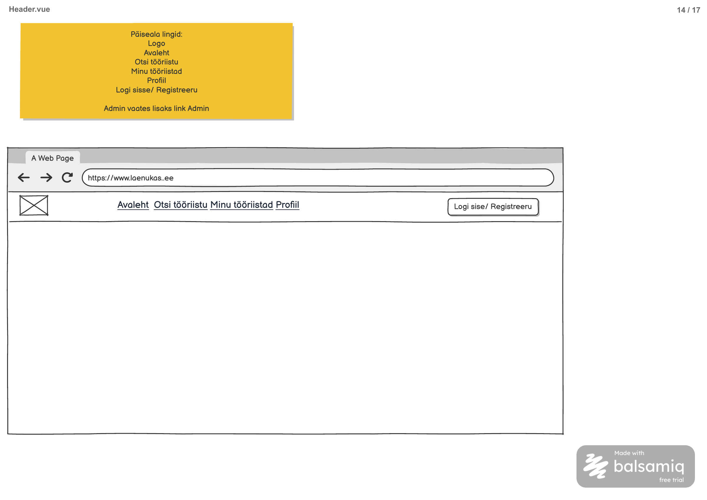

# Sisselogitud kasutaja päring

**Teenus:** `GET /api/me`

**Vaste balsamic mockupis:** Header.vue (eraldi STEP-tähis puudub), lehekülg 14/17 failis [Laenukas2509.pdf](../../../balsamic/notes/Laenukas2509.pdf) (vt `Sisselogitud-kasutaja-paring.png`).



Täiendavad allikad: [Header märkmed](../../../balsamic/notes/Header-markmed.md) ja [googlega_login.md](../../../balsamic/notes/googlega_login.md) (jaotis „7. `/api/me` endpoint“, `AppUserPrincipal`, `SecurityConfig`). Task kirjeldab backend'i teenust, mitte Vue vaate teostust.

## Sisend

Teenusel puuduvad sisendid: path variable'id, query parameetrid ja request body puuduvad.

Kasutaja tuvastatakse sessioonist (küpsis `JSESSIONID`, `@AuthenticationPrincipal AppUserPrincipal`):
- `principal.getUserId()`: `app_user.id`, mis pandi sessiooni sisselogimisel (`AppUserOidcService`);
- `principal.getEmail()`: Google'i e-post, mida kasutatakse ainult siis, kui profiili pole.

Controller (vt `googlega_login.md`):

```java
@GetMapping("/api/me")
public CurrentUserDto getCurrentUser(@AuthenticationPrincipal AppUserPrincipal principal) {
    return appUserService.getCurrentUser(principal.getUserId(), principal.getEmail());
}
```

## Väljund

**Response (200 OK):** `CurrentUserDto`, sisse logitud kasutaja põhiandmed.

Näide: Liis Kask (`userId = 3`, customer, profiiliga):

```json
{
  "userId": 3,
  "firstName": "Liis",
  "lastName": "Kask",
  "roleName": "customer",
  "email": "liis.kask@example.com",
  "hasProfile": true
}
```

Näide: Marko Tamm (`userId = 1`, admin, profiiliga):

```json
{
  "userId": 1,
  "firstName": "Marko",
  "lastName": "Tamm",
  "roleName": "admin",
  "email": "email@Gmail.com",
  "hasProfile": true
}
```

Näide: esimest korda sisse loginud kasutaja, kellel profiili pole. Andmed on võetud PDF-i lehekülje 11 kollase märkuse näitest (Mari Maasikas, `user@gmail.com`, `user_id = 583`), nagu [Profiili andmete päringu](../MyProfile/Profiili-andmete-paring.md) taskis:

```json
{
  "userId": 583,
  "firstName": "Mari",
  "lastName": "Maasikas",
  "roleName": "customer",
  "email": "user@gmail.com",
  "hasProfile": false
}
```

DTO (vt `googlega_login.md`):

```java
public record CurrentUserDto(
        Integer userId,
        String firstName,
        String lastName,
        String roleName,
        String email,
        boolean hasProfile
) {}
```

| Väli | Allikas | Selgitus |
|---|---|---|
| `userId` | `app_user.id` | |
| `firstName` | `app_user.first_name` | |
| `lastName` | `app_user.last_name` | Võib olla `""`, kui Google perenime ei andnud |
| `roleName` | `role.role_name` | `admin` või `customer`; päis näitab linki „Admin“ ainult väärtusega `admin` |
| `email` | `profile.email`, profiili puudumisel `principal.getEmail()` | Profiilita kasutajal kasutatakse MyProfile vormi eeltäitmiseks |
| `hasProfile` | kas `profile` rida on olemas | `false` korral suunab frontend lehele `/profile` |

`google_sub`, `status`, telefon ja aadress vastusesse ei lähe. Päring ei muuda andmeid.

## Eesmärk

`Header.vue` küsib seda teenust rakenduse käivitumisel, et otsustada, milliseid linke näidata. Vastus 401 tähendab külastajat (nupp „Logi sisse / Registreeru“). Vastus 200 tähendab sisse logitud kasutajat („Minu tööriistad“, „Profiil“, „Logi välja“); `roleName = "admin"` lisab lingi „Admin“ ja `hasProfile = false` suunab profiili täitma. Sama vastust kasutavad teised vaated (nt MyProfile) kasutaja tuvastamiseks.

## Seotud andmebaasi tabelid

Vt [2_create.sql](../../../database/2_create.sql).

### `app_user`

```sql
CREATE TABLE app_user (
    id serial PRIMARY KEY,
    role_id integer NOT NULL REFERENCES role (id),
    first_name varchar(100) NOT NULL,
    last_name varchar(100) NOT NULL,
    google_sub varchar(255) NOT NULL UNIQUE,
    status char(1) NOT NULL DEFAULT 'A' CHECK (status IN ('A', 'B'))
);
```

### `role`

```sql
CREATE TABLE role (
    id serial PRIMARY KEY,
    role_name varchar(20) NOT NULL UNIQUE
);
```

### `profile`

```sql
CREATE TABLE profile (
    id serial PRIMARY KEY,
    user_id integer NOT NULL UNIQUE REFERENCES app_user (id),
    location_id integer NOT NULL REFERENCES location (id),
    email varchar(254) NOT NULL UNIQUE,
    phone varchar(32) NOT NULL,
    created_at timestamp NOT NULL DEFAULT current_timestamp,
    updated_at timestamp NOT NULL DEFAULT current_timestamp
);
```

Profiil on valikuline: otsida `Optional` tüübiga (nt `ProfileRepository.findByUser(...)`, vt `spring_mail.md`).

Algandmed failist [3_import.sql](../../../database/3_import.sql):

| app_user.id | Nimi | role | status | profile.email |
|---|---|---|---|---|
| 1 | Marko Tamm | admin (1) | A | email@Gmail.com |
| 3 | Liis Kask | customer (2) | A | liis.kask@example.com |

Demokasutajate `google_sub` on võltsväärtus (`demo-marko-tamm`, `demo-liis-kask`), seega nendena Google'iga sisse logida ei saa. Testides luua `AppUserPrincipal` käsitsi ja anda see päringule `SecurityMockMvcRequestPostProcessors.authentication(new OAuth2AuthenticationToken(principal, principal.getAuthorities(), "google"))` abil. Tavaline `oidcLogin()` loob `DefaultOidcUser`-i, mitte `AppUserPrincipal`-i, ja siis on controlleri `principal` `null`. Käsitsi testimiseks saab ka siduda oma `sub` demokasutajaga, nagu `googlega_login.md` jaotises 9. Profiilita kasutaja testiks tuleb luua `app_user` rida ilma profiilita.

`location`, `tool` ja `booking` ei osale päringus.

## Veaolukorrad

Vastuse kuju on olemasolev `ApiError` (`message`, `errorCode`).

| Olukord | Status code | Response body |
|---|---|---|
| Kasutaja pole sisse logitud (sessiooni pole või see on aegunud). | 401 Unauthorized | tühi (Spring Security `HttpStatusEntryPoint`) |
| Andmebaasipäring ebaõnnestub ootamatult. | 500 Internal Server Error | `{"errorCode":"INTERNAL_SERVER_ERROR","message":"Kasutaja andmete laadimine ebaõnnestus. Palun proovi hiljem uuesti."}` |

- 401 ei ole frontendi jaoks viga, vaid tähendab külastajat. Seda ei tagasta `RestExceptionHandler`, vaid Spring Security enne controllerit.
- Blokeeritud kasutaja (`status = 'B'`) ei saa sisse logida (`AppUserOidcService` viskab `OAuth2AuthenticationException`), seega ta ei jõua selle teenuseni.
- Profiili puudumine ei ole viga (200, `hasProfile = false`).
- Ühtne 500 kuju tuleb teostamisel tagada, sest praegune `RestExceptionHandler` seda ei käsitle.

## Vastuvõtu kriteeriumid

- [ ] `GET /api/me` on olemas ja nõuab sisselogimist.
- [ ] Vastus sisaldab täpselt välju `userId`, `firstName`, `lastName`, `roleName`, `email`, `hasProfile`.
- [ ] Liis Kask saab `roleName = "customer"`, Marko Tamm `roleName = "admin"`; mõlemal `hasProfile = true` ja e-post profiilist.
- [ ] Profiilita kasutaja saab 200, `hasProfile = false` ja e-posti Google'i sessioonist.
- [ ] Kasutaja ID võetakse ainult sessioonist; teise kasutaja andmeid selle teenusega kätte ei saa.
- [ ] `google_sub` ja `status` pole vastuses.
- [ ] Sisse logimata päring saab 401 tühja body'ga (mitte 302 ümbersuunamist Google'i lehele).
- [ ] Andmebaasi tõrge annab kirjeldatud 500 vastuse.
- [ ] Automaattestid (käsitsi loodud `AppUserPrincipal`-iga) katavad customer'i, admini, profiilita kasutaja, 401 ja 500 juhtumi.
