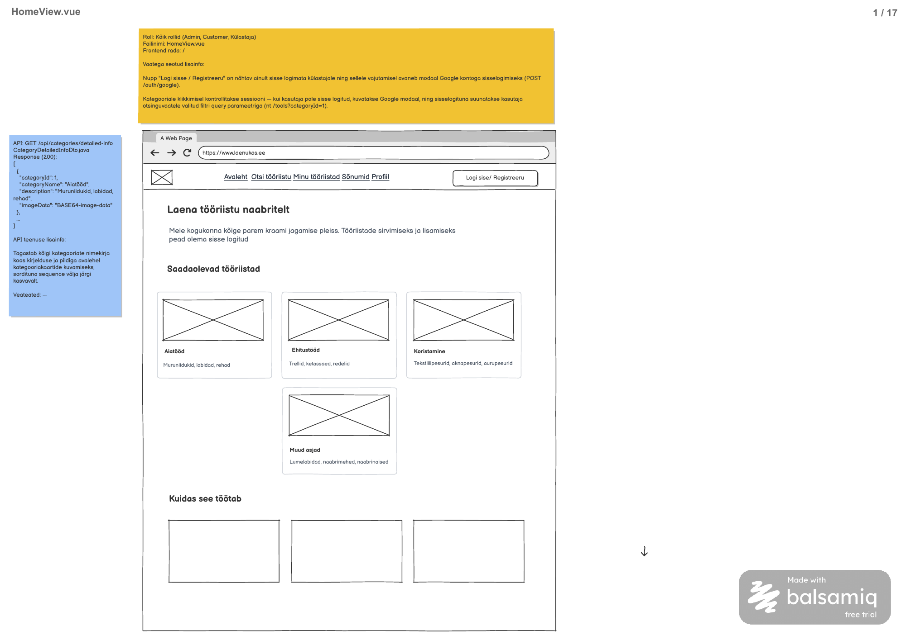

# Kategooriate detailinfo päring

**Teenus:** `GET /api/categories/detailed-info`

**Vaste balsamic mockupis:** HomeView.vue (eraldi STEP-tähis puudub), lehekülg 1/17 failis [Laenukas.pdf](../../../balsamic/notes/Laenukas.pdf) (vt lisatud pilt `Kategooriate-detailinfo-paring.png`).



Täiendav allikas: [HomeView-markmed.md](../../../balsamic/notes/HomeView-markmed.md). Task kirjeldab backend'i teenust, mitte HomeView ega Google autentimise teostust.

## Sisend

Teenusel puuduvad sisendid. Path variable'id, query parameetrid ja request body puuduvad. Teenus on avalik: avalehte ja kategooriaid näevad Admin, Customer ning sisse logimata Külastaja. Kategooria valimisel toimuv autentimise kontroll kuulub kasutajaliidese voogu ega piira selle loendi lugemist.

## Väljund

**Response (200 OK):** `List<CategoryDetailedInfoDto>`, JSON massiiv kõigist kategooriatest koos kirjelduse ja pildiga.

```json
[
  {
    "categoryId": 1,
    "categoryName": "Aiatööd",
    "description": "Muruniidukid, labidad, rehad",
    "imageData": "BASE64-image-data"
  }
]
```

See on PDF-i esimese elemendi näide; `BASE64-image-data` on mockupi kohatäitja, mitte tegelik vastuse väärtus. ID, nimi ja kirjeldus vastavad [3_import.sql](../../../database/3_import.sql) andmetele. Tegelik vastus sisaldab kõiki nelja imporditud kategooriat ning iga olemasoleva pildi tegelikku Base64 sisu.

`CategoryDetailedInfoDto.java` väljad:

| Väli | Java tüüp | Allikas ja tähendus |
|---|---|---|
| `categoryId` | `Integer` | `category.id` |
| `categoryName` | `String` | `category.category_name` |
| `description` | `String` | `category.description`; andmebaasi `NULL` korral JSON `null` |
| `imageData` | `String` | Seotud `category_image.image_data` baitide Base64 esitus; puuduva pildikirje korral JSON `null` |

Tagasta kategooriad järjestuses `category.sequence ASC`. Võrdse `sequence` korral kasuta `category.id ASC`, et tulemus oleks korduv: see on taski tehniline täpsustus, mida mockup eraldi ei määra. `sequence` ja pildikirje ID ei kuulu DTO-sse. Lehekülgjaotust ega tööriistade olemasolu järgi filtreerimist pole.

Taski tehnilised täpsustused skeemis lubatud servajuhtudele: puuduva pildiga kategooria säilib loendis ning selle `imageData` on `null`; tühi kategooriatabel annab HTTP 200 ja `[]`. Kategooria ja pildi ühendus peab seetõttu säilitama kõik kategooriad, näiteks `LEFT JOIN` abil.

Pildi kodeerimisel kasuta baitide tegelikku Base64 kodeerimist, näiteks `Base64.getEncoder().encodeToString(bytes)`, ilma reavahetuste ja `data:` prefiksita. Olemasolev `StringBytesConverter.bytesToString()` teisendab baidid UTF-8 tekstiks ega tee Base64 kodeerimist. Impordi pildid on UTF-8 SVG-d; nende kuvamisel sobib `image/svg+xml`, kuid praegune skeem ei talleta MIME-tüüpi. Muude pildiformaatide toetamise ja MIME-info edastamise leping tuleb eraldi täpsustada; sellele DTO-le ei lisata oletuslikku välja.

## Eesmärk

HomeView kasutab teenust avalehe kategooriakaartide kuvamiseks koos nime, kirjelduse ja pildiga. Kaardi `categoryId` võimaldab sisse loginud kasutaja suunata filtreeritud otsinguvaatesse, näiteks `/tools?categoryId=1`. Teenus tagastab ka kategooriad, millega ei ole seotud ühtegi tööriista, ega muuda andmebaasi.

See on eraldi kontrakt otsingufiltri teenusest `GET /api/categories`, mille task asub [ToolsView kaustas](../ToolsView/Kategooriate-nimekirja-paring.md). Google sisselogimine (`POST /auth/google`) on leheküljel mainitud kasutajavoo kontekstina; sellel pole siin eraldi API-kontrakti ja see ei kuulu käesolevasse taski.

## Seotud andmebaasi tabelid

Vt [2_create.sql](../../../database/2_create.sql).

### `category`

Kategooria nimi, kirjeldus ja avalehe kuvamisjärjekord.

```sql
CREATE TABLE category (
    id serial PRIMARY KEY,
    category_name varchar(100) NOT NULL UNIQUE,
    description varchar(255),
    sequence integer NOT NULL
);
```

`id` on primaarvõti. Nimi on kohustuslik ja unikaalne, kirjeldus võib puududa. `sequence` on kohustuslik, kuid mitte unikaalne.

### `category_image`

Kategooria pildi binaarandmed; kategoorial saab olla kuni üks pildikirje.

```sql
CREATE TABLE category_image (
    id serial PRIMARY KEY,
    category_id integer NOT NULL UNIQUE REFERENCES category (id),
    image_data bytea NOT NULL
);
```

`id` on primaarvõti, `category_id` kohustuslik unikaalne välisvõti tabelile `category`. Olemasoleva pildikirje `image_data` ei saa olla `NULL`, kuid skeem ei nõua iga kategooria kohta pildikirjet. Seos on `category.id = category_image.category_id`.

[3_import.sql](../../../database/3_import.sql) näidisandmed:

| category.id | category_name | description | sequence | category_image.id |
|---|---|---|---|---|
| 1 | Aiatööd | Muruniidukid, labidad, rehad | 100 | 1 |
| 2 | Ehitustööd | Trellid, ketassaed, redelid | 200 | 2 |
| 3 | Koristamine | Tekstiilipesurid, aknapesurid, aurupesurid | 300 | 3 |
| 4 | Muud | Lumelabidad, naabrimehed, naabrinaised | 10000 | 4 |

Iga pilt lisatakse importimisel `convert_to('<svg ...>...</svg>', 'UTF8')` kaudu. Need on SVG lähtefaili baidid, mitte juba Base64 tekst. Mockupi neljanda kaardi nimi „Muud asjad“ erineb impordist: API tagastab andmebaasi tegeliku nime „Muud“.

`tool`, `tool_image`, kasutajate ja broneeringute tabelid ei osale selles päringus. Tööriistade staatus ja saadavus kategoorialoendit ei mõjuta.

## Veaolukorrad

PDF-is on „Veateated: —“. Allolev 500 leping on taski tehniline täpsustus, mis järgib olemasoleva kategoorialoendi taski veavormingut. Sisendita avalikule päringule ei lisata 400/401/403/404 ärivigu; tühi tulemus ja puuduv kategooriapilt ei ole vead.

| Olukord | Status code | Response body |
|---|---|---|
| Andmebaasipäring ebaõnnestub ootamatult. | 500 Internal Server Error | `{"errorCode":"INTERNAL_SERVER_ERROR","message":"Kategooriate laadimine ebaõnnestus. Palun proovi hiljem uuesti."}` |

Kasuta olemasoleva `ApiError` kuju: `message` ja `errorCode` on stringid. Praegune `RestExceptionHandler` ei taga veel kirjeldatud 500 vastust; selle tagamine kuulub teenuse teostusse. SQL-i ja stack trace'i kliendile ei tagastata.

## Vastuvõtu kriteeriumid

- [ ] `GET /api/categories/detailed-info` on olemas, sisenditeta ja kättesaadav ka sisse logimata kasutajale.
- [ ] Vastus on HTTP 200 ja JSON massiiv; iga element sisaldab ainult `categoryId`, `categoryName`, `description` ja `imageData`.
- [ ] Andmed loetakse tabelitest `category` ja `category_image`; vastuses on kõik kategooriad, sealhulgas tööriistadeta kategooriad.
- [ ] Järjestus on `category.sequence ASC`, võrdse väärtuse korral `category.id ASC`.
- [ ] Impordiandmetega tagastatakse tabelis toodud neli kategooriat, sh nimi „Muud“; pildid on tegelike imporditud baitide Base64 esitus.
- [ ] Base64 dekodeerimisel saadakse tagasi täpselt andmebaasi pildibaidid; puuduvad data-URL prefiks ja topeltkodeerimine.
- [ ] Puuduva pildikirjega kategooria jääb vastusesse väärtusega `imageData: null`; puuduv kirjeldus annab `description: null`.
- [ ] Tühja kategooriatabeli korral tagastatakse `200` ja `[]`, mitte `404` või `null`.
- [ ] Andmebaasi tõrke korral tagastatakse kirjeldatud 500 `ApiError` ilma tehniliste detailideta.
- [ ] Päring ei muuda andmeid ega muuda olemasoleva `GET /api/categories` lihtloendi kontrakti.
- [ ] Automaattestid kontrollivad avalikku ligipääsu, DTO kuju, andmete täielikkust, pildi Base64 teisendust, sortimist, puuduvat pilti/kirjeldust, tühja tulemust ja 500 vastust. Sortimise testandmed eristavad `sequence` järjekorda sisestamisjärjekorrast ning sisaldavad võrdseid `sequence` väärtusi.
