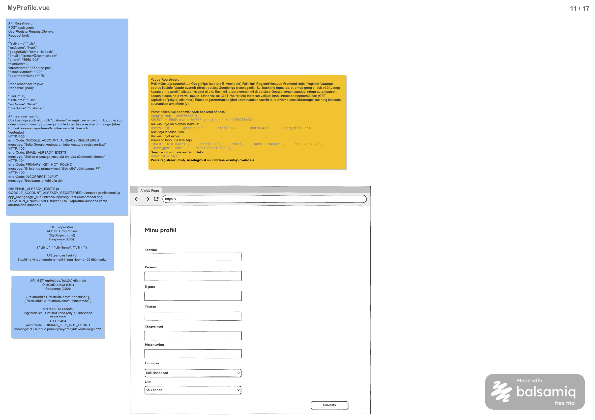

# Profiili salvestamine

**Teenus:** `PUT /api/users/me/profile`

**Vaste balsamic mockupis:** MyProfile.vue (eraldi STEP-tähis puudub), lehekülg 11/17 failis [Laenukas2509.pdf](../../../balsamic/notes/Laenukas2509.pdf) (vt `Profiili-salvestamine.png`).



Täiendavad allikad: [MyProfile märkmed](../../../balsamic/notes/MyProfile-markmed.md) ja [googlega_login.md](../../../balsamic/notes/googlega_login.md). Task kirjeldab backend'i teenust, mitte Vue vaate teostust.

PDF-i sinine märkus kirjeldab vana lahendust `POST /api/users`, kus `googleSub` saadetakse request body's ning `app_user` ja `profile` luuakse korraga. Kinnitatud silt asendab selle teenusega `PUT /api/users/me/profile`: `app_user` on juba Google'iga sisselogimisel loodud ja kasutaja tuvastatakse sessioonist. PDF-i veakoodidest jäävad alles `EMAIL_ALREADY_EXISTS`, `PRIMARY_KEY_NOT_FOUND` ja `INCORRECT_INPUT`. `GOOGLE_ACCOUNT_ALREADY_REGISTERED` kaob.

## Sisend

Request body (`ProfileUpdateRequestDto.java`):

| Väli | Java tüüp | Kohustuslik | Reegel | Andmebaasi veerg |
|---|---|---|---|---|
| `firstName` | `String` | Jah | Mitte tühi, kuni 100 märki | `app_user.first_name` |
| `lastName` | `String` | Jah | Mitte tühi, kuni 100 märki | `app_user.last_name` |
| `email` | `String` | Jah | Mitte tühi, e-posti vorming, kuni 254 märki, unikaalne | `profile.email` |
| `phone` | `String` | Jah | Mitte tühi, kuni 32 märki | `profile.phone` |
| `districtId` | `Integer` | Jah | Olemasoleva linnaosa `district.id` | `location.district_id` |
| `streetName` | `String` | Jah | Mitte tühi, kuni 150 märki | `location.street_name` |
| `houseNumber` | `String` | Jah | Mitte tühi, kuni 20 märki | `location.house_number` |
| `apartmentNumber` | `String` | Ei | Kuni 20 märki; `null` või tühi string salvestatakse `NULL`-ina | `location.apartment_number` |

Näide (PDF-i näide, mis ühtib faili `3_import.sql` kasutajaga Liis Kask, `userId = 3`):

```json
{
  "firstName": "Liis",
  "lastName": "Kask",
  "email": "liis.kask@example.com",
  "phone": "55501002",
  "districtId": 2,
  "streetName": "Sõpruse pst",
  "houseNumber": "120",
  "apartmentNumber": "8"
}
```

Päring nõuab sisselogimist. Kasutaja ID võetakse sessioonist (`@AuthenticationPrincipal AppUserPrincipal`). `userId`, `googleSub`, `cityId`, roll ja status päringus puuduvad: linn tuleneb `districtId`-st ning rolli ja staatust see teenus ei muuda.

## Väljund

**Response (200 OK):** tühi body (`Response (200): NONE`).

Ühes transaktsioonis (`@Transactional`):

**Kui kasutajal profiili pole** (esmane täitmine):
1. Luuakse `location` rida: `district_id`, `street_name`, `house_number`, `apartment_number`; `lng` ja `lat` = `NULL`.
2. Luuakse `profile` rida: `user_id` sessioonist, `location_id` = uus location, `email`, `phone`, `created_at` ja `updated_at` = praegune aeg.
3. Uuendatakse `app_user.first_name` ja `last_name`.

**Kui profiil on olemas** (muutmine):
1. Uuendatakse profiili olemasolevat `location` rida (`profile.location_id`). `lng` ja `lat` ei muutu.
2. Uuendatakse `profile.email`, `profile.phone` ja `profile.updated_at`. `created_at` ei muutu.
3. Uuendatakse `app_user.first_name` ja `last_name`.

Pärast edukat salvestamist vastab `GET /api/me` väärtusega `hasProfile: true`. Frontend suunab kasutaja avalehele (`/`).

## Eesmärk

Teenust kasutab MyProfile vaate nupp „Salvesta“. Sama teenusega täidab uus kasutaja pärast esimest Google'iga sisselogimist oma profiili (telefon, aadress, e-post) ja olemasolev kasutaja muudab hiljem oma andmeid. `googlega_login.md` järgi ei tohiks profiilita kasutaja tööriistu lisada ega broneerida, seega on see teenus eelduseks teistele tegevustele.

## Seotud andmebaasi tabelid

Vt [2_create.sql](../../../database/2_create.sql).

### `app_user`

```sql
CREATE TABLE app_user (
    id serial PRIMARY KEY,
    role_id integer NOT NULL REFERENCES role (id),
    first_name varchar(100) NOT NULL,
    last_name varchar(100) NOT NULL,
    google_sub varchar(255) NOT NULL UNIQUE,
    status char(1) NOT NULL DEFAULT 'A' CHECK (status IN ('A', 'B'))
);
```

Muudetakse ainult `first_name` ja `last_name`.

### `profile`

```sql
CREATE TABLE profile (
    id serial PRIMARY KEY,
    user_id integer NOT NULL UNIQUE REFERENCES app_user (id),
    location_id integer NOT NULL REFERENCES location (id),
    email varchar(254) NOT NULL UNIQUE,
    phone varchar(32) NOT NULL,
    created_at timestamp NOT NULL DEFAULT current_timestamp,
    updated_at timestamp NOT NULL DEFAULT current_timestamp
);
```

`email` on UNIQUE: teenus kontrollib enne salvestamist, kas sama e-post on **teise** kasutaja profiilil, et anda arusaadav 403 viga, mitte andmebaasi erind.

### `location`

```sql
CREATE TABLE location (
    id serial PRIMARY KEY,
    district_id integer NOT NULL REFERENCES district (id),
    street_name varchar(150) NOT NULL,
    house_number varchar(20) NOT NULL,
    apartment_number varchar(20),
    lng decimal(10, 7),
    lat decimal(10, 7)
);
```

### `district` (ainult kontroll)

```sql
CREATE TABLE district (
    id serial PRIMARY KEY,
    city_id integer NOT NULL REFERENCES city (id),
    district_name varchar(100) NOT NULL,
    CONSTRAINT district_city_name_unique UNIQUE (city_id, district_name)
);
```

`districtId` olemasolu kontrollitakse enne salvestamist.

Algandmed failist [3_import.sql](../../../database/3_import.sql):

| app_user.id | Nimi | profile.email | profile.phone | location |
|---|---|---|---|---|
| 1 | Marko Tamm | email@Gmail.com | 56565656 | 1: district 1 (Kristiine), Teddre 28, korter `NULL` |
| 3 | Liis Kask | liis.kask@example.com | 55501002 | 3: district 2 (Mustamäe), Sõpruse pst 120-8 |

Linnaosad: `district.id` 1–33 (Tallinn 1–8, Tartu 9–26, Pärnu 27–33). `districtId = 99` impordiandmetes puudub.

Testiandmete näited:

| Kasutaja | Päring | Tulemus |
|---|---|---|
| Liis (3) | näite body | 200, andmed muutumata (sama sisu) |
| Liis (3) | `email = "email@Gmail.com"` | 403 `EMAIL_ALREADY_EXISTS` (Marko e-post) |
| Liis (3) | `districtId = 99` | 404 `PRIMARY_KEY_NOT_FOUND` |
| Liis (3) | `firstName = ""` | 400 `INCORRECT_INPUT` |
| uus profiilita kasutaja | kehtiv body uue e-postiga | 200, luuakse `location` ja `profile` |

`tool`, `booking` ja `role` ei muutu.

## Veaolukorrad

Vastuse kuju on olemasolev `ApiError` (`message`, `errorCode`).

| Olukord | Status code | Response body |
|---|---|---|
| Kasutaja pole sisse logitud. | 401 Unauthorized | tühi (Spring Security) |
| `firstName` on tühi. | 400 Bad Request | `{"errorCode":"INCORRECT_INPUT","message":"firstName: ei tohi olla tühi"}` |
| Muu kohustuslik väli puudub või on tühi, väli on liiga pikk või e-posti vorming on vale. | 400 Bad Request | `{"errorCode":"INCORRECT_INPUT","message":"<väli>: <valideerimise teade>"}` |
| Linnaosa `districtId = 99` pole. Teates kasutada tegelikku väärtust. | 404 Not Found | `{"errorCode":"PRIMARY_KEY_NOT_FOUND","message":"Ei leidnud primary keyd 'districtId' väärtusega: 99"}` |
| Sama e-post on teise kasutaja profiilil. | 403 Forbidden | `{"errorCode":"EMAIL_ALREADY_EXISTS","message":"Sellise e-postiga kasutaja on juba süsteemis olemas"}` |
| Andmebaasipäring ebaõnnestub ootamatult. | 500 Internal Server Error | `{"errorCode":"INTERNAL_SERVER_ERROR","message":"Profiili salvestamine ebaõnnestus. Palun proovi hiljem uuesti."}` |

- 404 tuleb olemasolevast `PrimaryKeyNotFoundException` klassist.
- `EMAIL_ALREADY_EXISTS` on PDF-i märkusest pärit uus kood. Seda visatakse olemasoleva `ForbiddenException` klassiga. Oma senise e-posti uuesti salvestamine on lubatud (kontroll välistab kasutaja enda profiili). Võrdlus on täpne, nagu andmebaasi UNIQUE piirang.
- 400 tuleb `@Valid` + `@NotBlank`/`@Size`/`@Email`/`@NotNull` kaudu olemasolevast `handleMethodArgumentNotValid` handlerist. Teade `firstName: ei tohi olla tühi` eeldab annotatsiooni `@NotBlank(message = "ei tohi olla tühi")`; sama eestikeelset stiili kasutada ka teiste väljade puhul.
- Kontrollide järjekord: 400, 404, siis 403. Vea korral andmeid ei muudeta.

## Vastuvõtu kriteeriumid

- [ ] `PUT /api/users/me/profile` on olemas ja nõuab sisselogimist.
- [ ] Profiilita kasutaja kehtiv päring annab 200 tühja body'ga; luuakse `location` ja `profile` rida ning `app_user` nimed uuendatakse. Pärast seda annab `GET /api/me` `hasProfile = true`.
- [ ] Profiiliga kasutaja päring uuendab olemasolevaid `location`, `profile` ja `app_user` ridu; uut `location` rida ei looda ja `created_at`, `lng`, `lat` ei muutu.
- [ ] `apartmentNumber: null` või `""` salvestatakse `NULL`-ina.
- [ ] Oma senise e-posti uuesti salvestamine annab 200; teise kasutaja e-post annab 403 `EMAIL_ALREADY_EXISTS`.
- [ ] Olematu `districtId` annab 404 ja `PRIMARY_KEY_NOT_FOUND` teate päringu ID-ga.
- [ ] Tühi `firstName` annab 400 teatega `firstName: ei tohi olla tühi`; muud valideerimisvead annavad 400 `INCORRECT_INPUT`.
- [ ] Päringu body's antud `userId` või `googleSub` ei mõjuta midagi; roll ja status ei muutu.
- [ ] Vea korral ei muudeta ühtegi tabelit (transaktsioon).
- [ ] Sisse logimata kasutaja saab 401.
- [ ] Automaattestid katavad esmase loomise, muutmise, `null` korterinumbri, oma e-posti uuesti salvestamise, teise kasutaja e-posti, olematu linnaosa, valideerimisvead, 401 ja 500 juhtumi.
