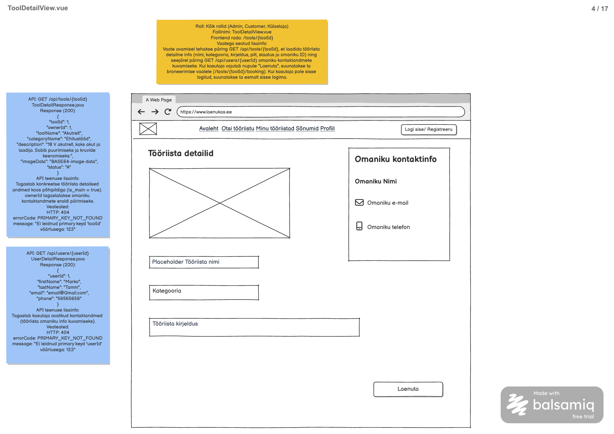

# Tööriista detailide päring

**Teenus:** `GET /api/tools/{toolId}`

**Vaste balsamic mockupis:** ToolDetailView.vue (eraldi STEP-tähis puudub), lehekülg 4/17 failis [Laenukas2509.pdf](../../../balsamic/notes/Laenukas2509.pdf) (vt `Tooriista-detailide-paring.png`).



Täiendav allikas: [ToolDetailView märkmed](../../../balsamic/notes/ToolDetailView-markmed.md). Task kirjeldab backend'i teenust, mitte Vue vaate teostust.

## Sisend

| Parameeter | Asukoht | Java tüüp | Kohustuslik | Tähendus |
|---|---|---|---|---|
| `toolId` | Path variable | `Integer` | Jah | Vaadatava tööriista `tool.id`. |

Query parameetrid ja request body puuduvad. Näide: `GET /api/tools/1`.

Päring on **avalik** kõigile rollidele, sh külastajale. `googlega_login.md` `SecurityConfig` lubab `GET /api/tools/**` ilma sisselogimiseta.

## Väljund

**Response (200 OK):** `ToolDetailResponse`, ühe tööriista andmed koos põhipildiga.

```json
{
  "toolId": 1,
  "ownerId": 1,
  "toolName": "Akutrell",
  "categoryName": "Ehitustööd",
  "description": "18 V akutrell, kaks akut ja laadija. Sobib puurimiseks ja kruvide keeramiseks.",
  "imageData": "BASE64-image-data",
  "status": "A"
}
```

Näide on sildilt ja ühtib failiga `3_import.sql` (`tool.id = 1`, omanik Marko Tamm `userId = 1`, kategooria 2 „Ehitustööd“). `"BASE64-image-data"` on sildi kohatäitja. Päris vastuses on `imageData` rea `tool_image.id = 1` baitide Base64 kuju: `Base64.getEncoder().encodeToString(bytes)`, ilma `data:` prefiksita. See on sama kuju nagu [Tööriistade nimekirja päringus](../ToolsView/Tooriistade-nimekirja-paring.md), et sama pilt näeks mõlemas vaates ühesugune. Impordiandmetes on pildid toored SVG-baidid, seega on tulemus SVG faili Base64. `StringBytesConverter` (UTF-8 tekst) siin ei sobi.

| Väli | Java tüüp | Allikas | Selgitus |
|---|---|---|---|
| `toolId` | `Integer` | `tool.id` | |
| `ownerId` | `Integer` | `tool.owner_id` | Frontend kasutab seda `GET /api/users/{userId}` päringus (ainult sisse logitud kasutajale) |
| `toolName` | `String` | `tool.name` | |
| `categoryName` | `String` | `category.category_name` (`tool.category_id`) | |
| `description` | `String` | `tool.description` | Võib olla `null` |
| `imageData` | `String` | `tool_image.image_data`, kus `is_main = true` | Baitide Base64 (`Base64.getEncoder().encodeToString(...)`); `null`, kui põhipilti pole |
| `status` | `String` | `tool.status` | `A` = saadaval, `U` = pole saadaval |

Ka `status = 'U'` tööriist tagastatakse (200). Vaade kuvab selle ja BookingFormView keelab broneerimise (vt [Laenutaotluse loomine](../BookingFormView/Laenutaotluse-loomine.md)). Päring ei muuda andmeid.

## Eesmärk

Teenus täidab ToolDetailView vaate (`/tools/{toolId}`) vasaku poole: pilt, tööriista nimi, kategooria ja kirjeldus. Vaade avatakse ToolsView kaardi nupust „Vaata detaile“. `ownerId` järgi küsib vaade sisse logitud kasutajale omaniku kontaktid; nupp „Laenuta“ viib broneerimise vormi.

## Seotud andmebaasi tabelid

Vt [2_create.sql](../../../database/2_create.sql).

### `tool`

```sql
CREATE TABLE tool (
    id serial PRIMARY KEY,
    owner_id integer NOT NULL REFERENCES app_user (id),
    category_id integer NOT NULL REFERENCES category (id),
    name varchar(150) NOT NULL,
    description varchar(2000),
    status char(1) NOT NULL DEFAULT 'A' CHECK (status IN ('A', 'U')),
    created_at timestamp NOT NULL DEFAULT current_timestamp,
    updated_at timestamp NOT NULL DEFAULT current_timestamp
);
```

### `category`

```sql
CREATE TABLE category (
    id serial PRIMARY KEY,
    category_name varchar(100) NOT NULL UNIQUE,
    description varchar(255),
    sequence integer NOT NULL
);
```

### `tool_image`

```sql
CREATE TABLE tool_image (
    id serial PRIMARY KEY,
    tool_id integer NOT NULL REFERENCES tool (id) ON DELETE CASCADE,
    image_data bytea NOT NULL,
    is_main boolean NOT NULL DEFAULT false,
    CONSTRAINT tool_image_data_unique UNIQUE (tool_id, image_data)
);

CREATE UNIQUE INDEX tool_image_one_main_unique ON tool_image (tool_id) WHERE is_main = true;
```

Tööriistal on kuni üks põhipilt (`tool_image_one_main_unique`). Teised pildid (`is_main = false`) vastusesse ei lähe.

Algandmed failist [3_import.sql](../../../database/3_import.sql):

| tool.id | name | Omanik (owner_id) | Kategooria | status | Põhipilt |
|---|---|---|---|---|---|
| 1 | Akutrell | Marko Tamm (1) | Ehitustööd (2) | A | on (tool_image 1) |
| 2 | Redel | Marko Tamm (1) | Ehitustööd (2) | U | on (2) |
| 3 | Tolmuimeja | Liis Kask (3) | Koristamine (3) | A | on (3) |
| 4 | Hekikäärid | Liis Kask (3) | Aiatööd (1) | A | on (4) |
| 5 | Muruniiduk | Marko Tamm (1) | Aiatööd (1) | A | on (5) |
| 6 | Survepesur | Marko Tamm (1) | Koristamine (3) | A | on (6) |
| 7 | Matkatelk | Marko Tamm (1) | Muud (4) | A | on (7) |
| 8 | Projektor | Liis Kask (3) | Muud (4) | A | on (8) |

Kõigil impordi tööriistadel on põhipilt. `imageData: null` testiks tuleb luua pildita tööriist. `app_user`, `profile` ja `booking` ei osale päringus.

## Veaolukorrad

Vastuse kuju on olemasolev `ApiError` (`message`, `errorCode`).

| Olukord | Status code | Response body |
|---|---|---|
| Tööriista `toolId = 123` pole. Teates kasutada tegelikku väärtust. | 404 Not Found | `{"errorCode":"PRIMARY_KEY_NOT_FOUND","message":"Ei leidnud primary keyd 'toolId' väärtusega: 123"}` |
| `toolId` pole täisarv. | 400 Bad Request | `{"errorCode":"INCORRECT_INPUT","message":"toolId: peab olema Integer-tüüpi täisarv"}` |
| Andmebaasipäring ebaõnnestub ootamatult. | 500 Internal Server Error | `{"errorCode":"INTERNAL_SERVER_ERROR","message":"Tööriista laadimine ebaõnnestus. Palun proovi hiljem uuesti."}` |

- 404 tuleb olemasolevast `PrimaryKeyNotFoundException` klassist.
- Path variable'i 400 ja ühtne 500 kuju tuleb teostamisel tagada, sest praegune `RestExceptionHandler` neid automaatselt ei käsitle. SQL-i ega stack trace'i ei tagastata.

## Vastuvõtu kriteeriumid

- [ ] Avalik `GET /api/tools/{toolId}` töötab ka sisse logimata kasutajale.
- [ ] Vastus sisaldab täpselt välju `toolId`, `ownerId`, `toolName`, `categoryName`, `description`, `imageData`, `status`.
- [ ] `toolId = 1` annab näites toodud väärtused ja `imageData` on `tool_image` rea 1 baitide Base64 kuju; dekodeerimisel saadakse täpselt andmebaasi baidid.
- [ ] `toolId = 2` (status `U`) tagastatakse samuti 200-ga.
- [ ] Ainult `is_main = true` pilt läheb vastusesse; pildita tööriistal on `imageData = null`.
- [ ] Olematu `toolId` annab 404 ja `PRIMARY_KEY_NOT_FOUND` teate päringu ID-ga; vigane `toolId` annab 400.
- [ ] Päring ei muuda andmeid.
- [ ] Automaattestid katavad avaliku ligipääsu, DTO kuju, `U` staatuse, põhipildi valiku, pildita tööriista ning 400/404/500 juhtumid.
