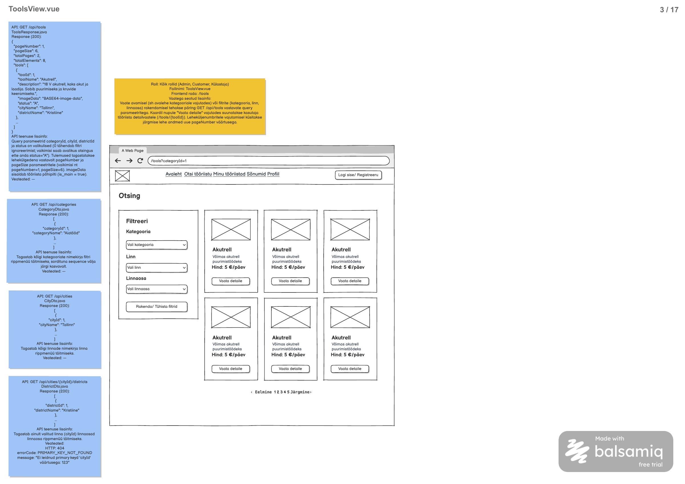

# Linnade nimekirja päring

**Teenus:** `GET /api/cities`

**Vaste balsamic mockupis:** ToolsView.vue (eraldi STEP-tähis puudub), lehekülg 3/17 failis [Laenukas.pdf](../../../balsamic/notes/Laenukas.pdf) (vt `Linnade-nimekirja-paring.png`).



Täiendav allikas: [ToolsView märkmed](../../../balsamic/notes/ToolsView-markmed.md). Task kirjeldab backend'i teenust, mitte Vue vaate teostust.

## Sisend

Teenusel puuduvad sisendid. Path variable'id, query parameetrid ja request body puuduvad. Päring on avalik: ToolsView märkmetes on lubatud Admin, Customer ja Külastaja.

## Väljund

**Response (200 OK):** `List<CityDto>`, JSON massiiv kõigist viiteandmete kirjetest.

```json
[
  {
    "cityId": 1,
    "cityName": "Tallinn"
  },
  {
    "cityId": 2,
    "cityName": "Tartu"
  },
  {
    "cityId": 3,
    "cityName": "Pärnu"
  }
]
```

`CityDto.java` sisaldab ainult `Integer cityId` ja `String cityName`. Need vastavad tabeli `city` väljadele `id` ja `city_name`. Lehekülgjaotust pole.

PDF-is on loendi esimene element ja jätkumist tähistav `...`; siin on täielik vastus [3_import.sql](../../../database/3_import.sql) andmetega. Järjestus on `city.id ASC`. PDF ei määra sortimist; ID-järjestus on taski tehniline täpsustus korratavaks vastuseks.

Tühja tabeli korral tagastada HTTP 200 ja `[]`, mitte `null` või 404. Andmed loetakse andmebaasist, mitte koodi kirjutatud loendist.

## Eesmärk

Teenus täidab ToolsView otsinguvormi linna rippmenüü. Valiku ID kasutatakse tööriistade päringu filtrina. Viiteandmete loend sisaldab ka kirjeid, millega pole parajasti seotud ühtegi tööriista.

Teenust ei dubleerita, kui sama URL-i teenus on teise vaate jaoks juba olemas. Järgida skill'ide ja backend/CLAUDE.md kihtide konventsioone; Controller väljastab DTO-sid. Päring ei muuda andmeid.

## Seotud andmebaasi tabelid

Vt [2_create.sql](../../../database/2_create.sql).

### `city`

```sql
CREATE TABLE city (
    id serial PRIMARY KEY,
    city_name varchar(100) NOT NULL UNIQUE
);
```

`city_name` on kohustuslik ja unikaalne. `district`, `location`, `profile` ja `tool` ei osale linnade loendi päringus; linn ei pea sisaldama kasutajaid või tööriistu.

Näidisandmete ID-d ja nimed on esitatud eespool olevas täielikus JSON-is.

## Veaolukorrad

PDF-is on „Veateated: —”. Allolev 500 on taski tehniline täpsustus. Sisendita avaliku loendi jaoks ei lisata 400/401/403/404 ärivigu.

| Olukord | Status code | Response body |
|---|---|---|
| Andmebaasipäring ebaõnnestub ootamatult. | 500 Internal Server Error | `{"errorCode":"INTERNAL_SERVER_ERROR","message":"Linnade laadimine ebaõnnestus. Palun proovi hiljem uuesti."}` |

Kasuta olemasoleva `ApiError` kuju: `message` ja `errorCode` on String-väljad. Praegune `RestExceptionHandler` ei taga veel seda 500 lepingut. SQL-i ega stack trace'i kliendile ei tagastata.

## Vastuvõtu kriteeriumid

- [ ] `GET /api/cities` on kättesaadav ka ilma sisselogimiseta ega vaja päringu sisendeid.
- [ ] Vastus on HTTP 200 ja massiiv, mille elementidel on ainult `cityId` ning `cityName`.
- [ ] Tagastatakse kõik tabeli `city` kirjed järjestuses `city.id ASC`.
- [ ] Impordiandmetega vastab tulemus eespool toodud 3 kirjega JSON-ile.
- [ ] Tööriistadeta viitekirjed säilivad vastuses; tühja tabeli korral on vastus `[]`.
- [ ] Andmebaasi tõrkel tagastatakse kirjeldatud 500 `ApiError`; tehnilisi detaile ei avaldata.
- [ ] Päring ei muuda andmeid ega lisa paralleelset endpoint'i sama funktsiooni jaoks.
- [ ] Automaattestid kontrollivad avalikku ligipääsu, DTO kuju, täielikku loendit, sortimist, tühja tulemust ja 500 vastust. Sortimise testandmed peavad eristama nõutud järjekorda juhuslikust sisestamisjärjekorrast.
