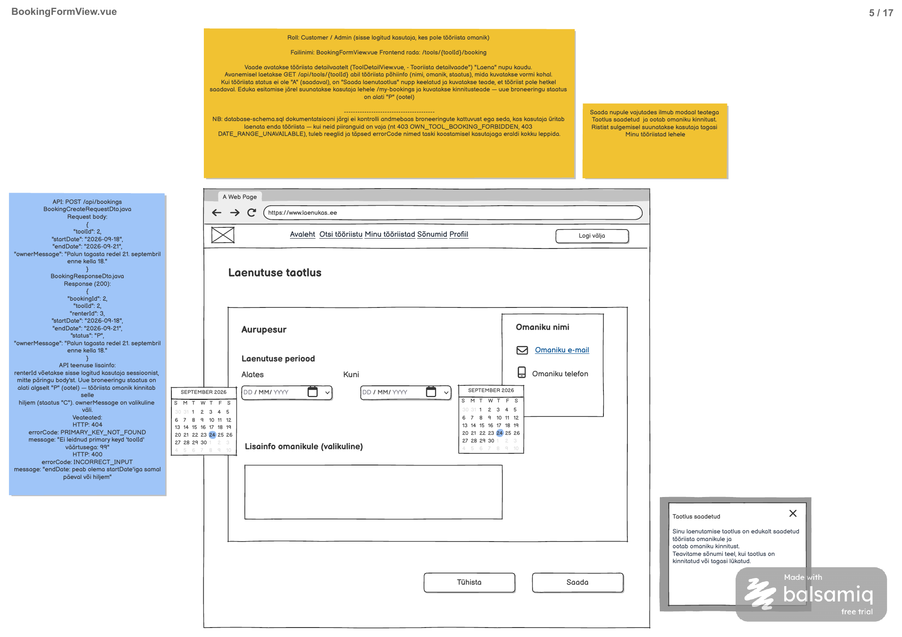

# Laenutaotluse esitamine

**Vaade:** `BookingFormView.vue`, route `/tools/:toolId/booking` (mockupi kuju `/tools/{toolId}/booking`).

**Roll:** Customer / Admin, sisse logitud kasutaja, kes pole tööriista omanik.

**Vaste balsamic mockupis:** BookingFormView.vue, lehekülg 5/17 failis [Laenukas.pdf](../../../balsamic/notes/Laenukas.pdf).



Allikad: [BookingFormView-markmed.md](../../../balsamic/notes/BookingFormView-markmed.md), [ToolDetailView-markmed.md](../../../balsamic/notes/ToolDetailView-markmed.md) ning kasutaja täpsustused. Kasutaja kinnitas modaali sulgemise sihiks „Minu tööriistad” ja oma tööriista broneerimise alerti.

## Kasutajavoog

Kasutaja avab tööriista detailvaatelt broneerimisvormi ning näeb tööriista ja omaniku andmeid. Ta valib algus- ja lõppkuupäeva, lisab soovi korral teate ning saadab taotluse. Edukas vastus avab „Taotlus saadetud” modaali; alles modaali sulgemisel suunatakse kasutaja „Minu tööriistad” vaatesse. „Tühista” viib tagasi eelmisele vaatele ilma broneerimise API kutseta; taotluse kinnitamine, sõnumite saatmine ja Google Calendar integratsioon ei kuulu selle vormi taski.

## Kasutajaliidese elemendid

| Element | Tüüp | Kirjeldus/käitumine |
|---|---|---|
| Logo ja päise navigatsioon | Ühine päis | Avaleht, Otsi tööriistu, Minu tööriistad, Sõnumid, Profiil ja Logi välja; kasuta ühist navigatsiooni/autentimise teostust. |
| Laenutuse taotlus | Pealkiri | Vormi pealkiri. |
| Tööriista nimi | Tekst | `toolName` API-st; mockupi „Aurupesur” on näidis, mitte fikseeritud väärtus. |
| Omaniku nimi, e-mail, telefon | Kontaktiplokk | Omaniku tegelikud andmed; e-post mailto-lingina. |
| Laenutuse periood | Jaotis | Kaks kuupäevavalijat kalendri avamisega. |
| Alates | Kuupäevaväli | Kohustuslik startDate. Kuvavorming võib olla lokaalne, API-le saadetakse YYYY-MM-DD. |
| Kuni | Kuupäevaväli | Kohustuslik endDate, mitte varasem kui startDate. |
| Lisainfo omanikule (valikuline) | Tekstiala | ownerMessage, kuni 500 märki. |
| Tühista | Nupp | Tagasi eelmisele vaatele, POST päringut ei tehta. |
| Saada | Nupp | Valideerib ja saadab; keelatud laadimisel, saatmisel ning kui tool.status ei ole A. |
| Saadavuse/valideerimise/teenuse viga | Alert | Näitab konkreetset viga; own-tool veal täpne kasutaja määratud tekst. |
| Taotlus saadetud | Kinnitusmodaal | Avaneb alles eduka POST vastuse järel, sisaldab sulgemisristi. Sulgemine suunab „Minu tööriistad” vaatesse. |

Modaali tekst mockupi järgi: „Sinu laenutamise taotlus on edukalt saadetud tööriista omanikule ja ootab omaniku kinnitust. Teavitame sõnumi teel, kui taotlus on kinnitatud või tagasi lükatud.” Teavitamise teostus on eraldi sõltuvus, mitte selle taski POST kõrvaltoime.

## Käitumine ja valideerimine

1. Kontrolli sessiooni olemasoleva ühise autentimise kaudu. Lae `beforeMount` kaudu route'i toolId järgi tööriist, seejärel selle ownerId järgi omaniku kontaktandmed. Sõltuvad päringud käivad järjest; route'i ID peab olema positiivne täisarv.
2. Laadimise ajal ära luba saatmist. Vigane route'i ID või tööriista laadimise 404 näitab viga ega ava toimivat saatmisvormi. Kontaktipäringu tõrget ei esitata tühjade väljamõeldud kontaktandmetena; kuva viga ja võimalda korduslaadimist.
3. Kui tööriista status ei ole A, keela Saada ja kuva saadavuse teade. Kinnitamata kuupäevade kattuvuse reegleid ega mineviku kuupäevade keeldu ei lisata.
4. Enne saatmist kontrolli mõlema kuupäeva olemasolu, kehtivust, `endDate >= startDate` ning sõnumi maksimaalset pikkust 500. Sama päeva periood on lubatud. Tühja valikulise sõnumi võib saata nullina.
5. Saada ainult toolId, startDate, endDate ja ownerMessage. renterId ega status ei saadeta. Kasuta ühise autentimislahenduse CSRF lepingut.
6. Saatmise ajal blokeeri korduv vajutus. Vea korral säilita sisestatud andmed ja vabasta saatmisolek `.finally()` kaudu; võrguvea korral ära POST-i automaatselt korda, kuna vastuse kadumine ei tõenda salvestamise ebaõnnestumist.
7. HTTP 403 ja errorCode `OWN_TOOL_BOOKING_FORBIDDEN` korral kuva täpselt alert „Enda tööriista ei saa laenata” Ära ava kinnitusmodaali ega suuna kasutajat ära. Backend peab keeldu kontrollima ka siis, kui FE lisab ownerId põhise ennetava kontrolli.
8. HTTP 200 korral ava kinnitusmodaal, hoia vorm korduva saatmise eest lukus. Kõik modaali sulgemisteed kasutavad ühte handler'it, mis suunab „Minu tööriistad” vaatesse. Mitte kohe pärast POST-i ega `/my-bookings` rajale.
9. „Tühista” liigub brauseriajaloos tagasi; ajaloota otseavamisel kasuta tehnilise täpsustusena tööriista detailvaadet `/tools/:toolId`. Saatmise ajal keela vormi nupud, et käimasolevat päringut ei tõlgendataks tühistatuks.

**Navigatsiooni sõltuvus:** kasutaja kinnitas sihtvaate nime. [MyToolsView märkmed](../../../balsamic/notes/MyToolsView-markmed.md) pakuvad `/my-tools`, kuid märgivad selle veel kavandiks. Ühenda sulgemishandler MyToolsView navigeerimisega; täpne route tuleb sihtvaate teostamisel kinnitada. Praeguses router'is pole broneerimis-, detail- ega MyToolsView rada.

## API kutsed

### `POST /api/bookings`

**Backend task:** [Laenutaotluse loomine](../../backend/BookingFormView/Laenutaotluse-loomine.md). Backend realisatsioon praegu puudub; aluseks on see task ja kasutaja kinnitatud keeld.

`BookingCreateRequestDto.java` — request body:

```json
{
  "toolId": 2,
  "startDate": "2026-09-18",
  "endDate": "2026-09-21",
  "ownerMessage": "Palun tagasta redel 21. septembril enne kella 18."
}
```

`BookingResponseDto.java` — response (200):

```json
{
  "bookingId": 2,
  "toolId": 2,
  "renterId": 3,
  "startDate": "2026-09-18",
  "endDate": "2026-09-21",
  "status": "P",
  "ownerMessage": "Palun tagasta redel 21. septembril enne kella 18."
}
```

Näidis pärineb mockupist. Impordis on bookingId 2 juba olemas staatusega C ning tööriist 2 staatusega U; seda ei kasutata eduka UI testi fikseeritud tulemusena. Tegelik bookingId genereeritakse, renterId tuleb sessioonist ja uue kirje status on alati P.

**Veateated:**

| Status code | errorCode | message | Frontend käitumine |
|---|---|---|---|
| 403 | OWN_TOOL_BOOKING_FORBIDDEN | Enda tööriista ei saa laenata | Kuva täpselt sama tekst alertis, säilita vorm, ära ava modaali. |
| 404 | PRIMARY_KEY_NOT_FOUND | Ei leidnud primary keyd 'toolId' väärtusega: 123 | Kuva tööriista puudumise viga ja keela edasine saatmine. |
| 400 | INCORRECT_INPUT | endDate: peab olema startDate'iga samal päeval või hiljem | Kuva kuupäevaviga, säilita andmed. |
| 400 | INCORRECT_INPUT | `<väli>: <valideerimisvea kirjeldus>` | Kuva serveri sisendiviga. |
| 401 | Puudub | Tühi body | Käivita ühine aegunud sessiooni käsitlus; ära kinnita saatmist. |
| 500 | INTERNAL_SERVER_ERROR | Laenutaotluse saatmine ebaõnnestus. Palun proovi hiljem uuesti. | Kuva üldine viga. |
| Vastus puudub | Puudub | Määramata | Kuva võrguviga, ära eelda error.response olemasolu ega korda POST-i automaatselt. |
| Muu 403 | Määramata | Määramata | Üldine ligipääsu/CSRF viga; ära näita oma tööriista alerti üksnes staatuse põhjal. |

Konkreetsete ärivigade JSON-kuju:

```json
{
  "errorCode": "OWN_TOOL_BOOKING_FORBIDDEN",
  "message": "Enda tööriista ei saa laenata"
}
```

```json
{
  "errorCode": "PRIMARY_KEY_NOT_FOUND",
  "message": "Ei leidnud primary keyd 'toolId' väärtusega: 123"
}
```

```json
{
  "errorCode": "INCORRECT_INPUT",
  "message": "endDate: peab olema startDate'iga samal päeval või hiljem"
}
```

```json
{
  "errorCode": "INTERNAL_SERVER_ERROR",
  "message": "Laenutaotluse saatmine ebaõnnestus. Palun proovi hiljem uuesti."
}
```

### `GET /api/tools/{toolId}`

**Backend task:** puudub, realisatsioon puudub. Sõltuvus pärineb [ToolDetailView märkmetest](../../../balsamic/notes/ToolDetailView-markmed.md); teenuse task tuleb luua eraldi või paralleelselt. Sisendiks route'i toolId, body puudub.

`ToolDetailResponse.java` — response (200):

```json
{
  "toolId": 1,
  "ownerId": 1,
  "toolName": "Akutrell",
  "categoryName": "Ehitustööd",
  "description": "18 V akutrell, kaks akut ja laadija. Sobib puurimiseks ja kruvide keeramiseks.",
  "imageData": "BASE64-image-data",
  "status": "A"
}
```

`imageData` on näidise kohatäitja, broneerimisvorm pilti ei vaja. Kasuta toolName, status ja ownerId. Puuduva tööriista 404 annab ülal esitatud `PRIMARY_KEY_NOT_FOUND` JSON-i toolId kohta; kuva viga ja keela saatmine.

### `GET /api/users/{userId}`

**Backend task:** puudub, realisatsioon puudub. Omaniku kontaktide sõltuvus pärineb ToolDetailView märkmetest; BookingFormView wireframe näitab neid kontakte, kuid eraldi teenuse teostus ei kuulu broneeringu POST taski. Sisend on tööriista vastuse ownerId, mitte sessiooni rentija ID. Body puudub.

`UserDetailResponse.java` — response (200):

```json
{
  "userId": 1,
  "firstName": "Marko",
  "lastName": "Tamm",
  "email": "email@Gmail.com",
  "phone": "56565656"
}
```

404 veavastus:

```json
{
  "errorCode": "PRIMARY_KEY_NOT_FOUND",
  "message": "Ei leidnud primary keyd 'userId' väärtusega: 123"
}
```

Mõlema GET puhul kuva võrgu- või muu serverivea korral laadimisviga, mitte eduteadet. Kontaktide teenuse ligipääsureeglid tuleb täpsustada selle backend taskis; mockupi näidis ei tõenda olemasolevat avalikku endpoint'i.

## Komponendid ja failistruktuur

| Fail | Vastutus |
|---|---|
| `frontend/src/views/BookingFormView.vue` | Uus vaade, andmete laadimine, POST vastuse/vea käsitlemine ning suunamine. |
| `frontend/src/components/forms/BookingForm.vue` | Kuupäevad ja sõnum; `event-submit`, `event-cancel`, props tööriista/saatmise olekule. |
| `frontend/src/components/modals/BookingSentModal.vue` | Taotlus saadetud tekst ja `event-modal-closed`. |
| `frontend/src/components/common/OwnerContactCard.vue` | Omaniku nimi ja kontaktid props kaudu. |
| `frontend/src/api-services/BookingService.js` | POST /api/bookings. |
| `frontend/src/api-services/ToolService.js`, `UserService.js` | Tööriista ja omaniku GET sõltuvused, korduvkasutatavad detailvaatega. |
| `frontend/src/navigation/NavigationService.js` | MyToolsView ja tööriista detailvaatesse suunamine. |
| `frontend/src/router/index.js` | Lisa `/tools/:toolId/booking`; praegu on olemas ainult `/` ja `/test`. |

Vaade ja nimetatud alamkomponendid/teenused praegu puuduvad. Järgi dokumenteeritud Options API järjekorda `name`, `components`, `props`, `emits`, `data`, `computed`, `methods`, `beforeMount`. Päringud `.then()` / `.catch()` / `.finally()` kaudu, vastused ja vead eraldi handle-meetodites. Taski loomine ei muuda rakenduse koodi.

## Vastuvõtu kriteeriumid

- [ ] Vorm avaneb õige toolId jaoks ning näitab tööriista ja omaniku tegelikke andmeid.
- [ ] Kuupäevad on kohustuslikud; samapäevane periood on lubatud, pööratud vahemik ning üle 500 märgi pikk sõnum peatavad saatmise.
- [ ] Mitte-A staatusega tööriista korral on Saada keelatud ja põhjus kuvatud.
- [ ] POST sisaldab ainult nelja request välja; saatmise ajal pole topeltvajutus võimalik.
- [ ] 403 OWN_TOOL_BOOKING_FORBIDDEN näitab täpselt „Enda tööriista ei saa laenata”, ilma modaali või suunamiseta.
- [ ] Ainult 200 avab kinnitusmodaali; selle sulgemine viib „Minu tööriistad” vaatesse, mitte `/my-bookings`.
- [ ] Tühista ei tee POST päringut ja viib tagasi; ajaloota otseavamine kasutab detailvaate tagasiteed.
- [ ] GET vead, 400/401/403/404/500 ja vastuseta võrguviga on käsitletud ilma vale eduteateta; ebaõnnestunud POST säilitab sisestatud andmed.
- [ ] MyToolsView route, detail-/kontaktiteenused ning autentimise/CSRF sõltuvused on enne integreeritud kasutajavoo kontrolli olemas.
- [ ] Kontrollitud on edukas esitamine ja modaali sulgemine, oma tööriista keeld, saadavuse olek, valideerimise piirväärtused, topeltvajutus ja API vead.
