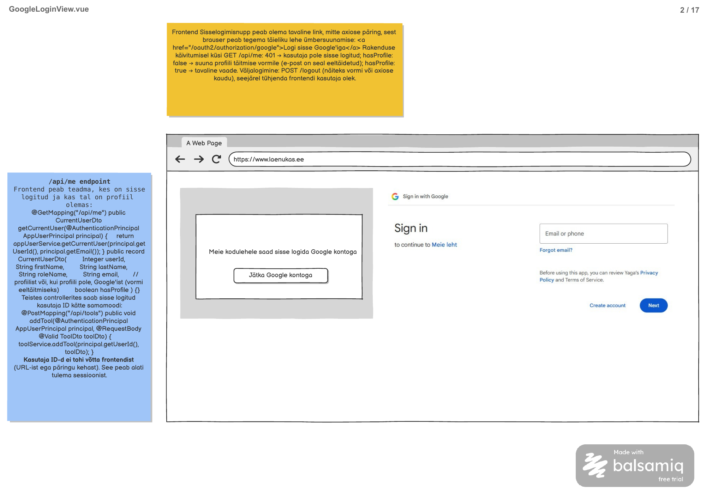

# Google kontoga sisselogimine

**Vaade:** `GoogleLoginView.vue`; eraldi route ei ole mockupil määratud. HomeView kontekstis avatakse sisselogimise modaal.

**Roll:** Sisse logimata külastaja; sessiooni kontroll ja väljalogimine puudutavad ka Admin ja Customer rolle.

**Vaste balsamic mockupis:** GoogleLoginView.vue, lehekülg 2/17 failis [Laenukas.pdf](../../../balsamic/notes/Laenukas.pdf).



## Kasutajavoog

Külastaja näeb sisselogimise teadet ning valib „Jätka Google kontoga“. Brauser suunatakse backendi kaudu Google sisselogimislehele ning õnnestumise järel tagasi avalehele. Rakenduse käivitamisel küsitakse `/api/me`: profiilita kasutaja suunatakse profiili täitmise vormile, profiiliga kasutaja jätkab tavavaates ning 401 korral jääb kasutaja külastajaks. Väljalogimine lõpetab sessiooni ja tühjendab frontendi kasutajaoleku; profiilivormi enda teostus ei kuulu sellesse taski.

## Kasutajaliidese elemendid

| Element | Tüüp | Kirjeldus/käitumine |
|---|---|---|
| Sisselogimise plokk | Dialoogi sisu | Mockupi vasakpoolne plokk, HomeView kaudu avatav modaali sisu. |
| „Meie kodulehele saad sisse logida Google kontoga“ | Tekst | Kuvatakse sisselogimise lingi kohal. |
| „Jätka Google kontoga“ | Nupuna kujundatud link | `href="/oauth2/authorization/google"`; täislehe navigatsioon, mitte Axios. |
| Google sisselogimisvorm | Väline leht | Mockupi parempoolne konto/e-posti sisend, „Forgot email?“, „Create account“, „Next“ ja muud Google elemendid kuuluvad Google lehele; Vue ei kogu Google paroole ega kopeeri seda vormi. |
| Sessiooni laadimise olek | Olek | Kuni `/api/me` vastus pole teada, ära suuna kasutajat profiilivormi ega käsitle teda kindlalt autendituna. |
| Sisselogimise või laadimise viga | Teade | `loginError` query korral näita üldist sisselogimise ebaõnnestumise teadet. Võrgu- ja serverivea korral näita eraldi sessiooni laadimise viga; täpne sõnastus on UI täpsustus. |
| Väljalogimine | Ühise navigatsiooni tegevus | PDF-i märkmetes kirjeldatud, kuid nupu asukohta pole joonisel näidatud. Seo ühise navigatsiooniga, ära lisa seda külastaja sisselogimisdialoogi. |

Brauseri raam, aadressiriba ja märkmelehed ei kuulu rakenduse UI-sse. Eraldi `/login` rada, modaali sulgemisnupp ja profiilivormi täpne rada ei ole lähteandmetes määratud; kooskõlasta need navigatsiooni teostamisel.

## Käitumine ja valideerimine

1. Käivita rakenduse ühine sessioonikontroll Options API `beforeMount` kaudu; ära tee dubleerivat `/api/me` päringut igas kaardis või modaali avamisel.
2. Kasuta HTTP päringuteks `.then()` / `.catch()` / `.finally()` ning eraldi vastuse ja vea `handle...` meetodeid. Erista olekuid laadimine, autenditud, külastaja ja päringu viga.
3. 200 korral salvesta ühisesse kasutajaolekusse kõik kuus DTO välja. `hasProfile: false` korral ava profiili täitmise vaade ja eeltäida e-post DTO-st. Profiilivormi route puudub praegu ja tuleb enne selle haru valmimist määrata; ära mõtle välja URL-i.
4. 401 korral tühjenda varasem kasutajaolek ja näita külastaja UI-d. Ära käivita automaatset Google redirect'i; see algab kasutaja lingivalikust. Võrguviga või 500 ei tõenda, et kasutaja on välja logitud: kuva viga ja võimalda uut kontrolli.
5. Sisselogimislingil puudub kohalik sisendi valideerimine. Backend loob OAuth voo; frontend ei saada kasutaja ID-d ega salvesta Google tokenit või client secret'it.
6. Google tagasipöördumisel avalehele käivitub sessioonikontroll uuesti. `loginError` korral näita üldist viga, mitte tehnilisi Google andmeid. Varasema kategooriavaliku automaatset taastamist allikad ei määra.
7. Logout jaoks kasuta tavalist `POST /logout` vormi koos kehtiva CSRF tokeniga. Õnnestunud redirect laeb avalehe uuesti, tühjendab mälus oleva kasutajaoleku ning `/api/me` 401 kinnitab väljalogimise. Kui logout ebaõnnestub, ära väida, et serveri sessioon lõpetati.
8. Järgi backend taski CSRF lepingut: vajalik on tokeni väljastamise viis ning vormivälja/küpsise nimede kooskõlastus. Kaitset ei lülitata UI tööle saamiseks välja.

## API kutsed

**Backend task:** [Google kontoga sisselogimine](../../../tasks/backend/GoogleLoginView/Google-kontoga-sisselogimine.md). Olemasolev autentimise backend teostus puudub; leping tuleneb sellest taskist, PDF-i leheküljest 2 ja `googlega_login.md` juhendist.

### `GET /api/me`

Sisendid ja request body puuduvad. Sessiooniküpsis saadetakse samal originil automaatselt. `CurrentUserDto` — response (200):

```json
{
  "userId": 1,
  "firstName": "Marko",
  "lastName": "Tamm",
  "roleName": "admin",
  "email": "email@Gmail.com",
  "hasProfile": true
}
```

`userId` on arv; `firstName`, `lastName`, `roleName`, `email` on stringid; `hasProfile` on boolean. Näide vastab impordi kasutajale 1 (demo Google sub pole päris konto). Profiilita kasutajal on `hasProfile: false` ning e-post pärineb Google principal'ist; profiiliga kasutajal profiilist.

### `GET /oauth2/authorization/google`

Tavaline brauseri link, request body puudub. Backend suunab Google lehele; JSON vastust frontend ei töötle. Callback `/login/oauth2/code/google` kuulub backendile. Õnnestumisel järgneb redirect frontendi `/` rajale, ebaõnnestumisel `/?loginError`.

### `POST /logout`

Vormipõhine POST, rakenduse request body puudub peale CSRF vormivälja. Vajalikud on sessiooniküpsis ja värske CSRF token. Õnnestumisel `302` frontendi `/` rajale, JSON vastust pole.

**Veateated:**

| Status code / sündmus | errorCode | message | Frontend käitumine |
|---|---|---|---|
| `/api/me` 401 | Puudub | Puudub (tühi body) | Tühjenda kasutajaolek, näita külastaja UI-d. |
| `/api/me` 500 | INTERNAL_SERVER_ERROR | Kasutaja andmete laadimine ebaõnnestus. Palun proovi hiljem uuesti. | Kuva viga ja võimalda uut kontrolli. |
| HTTP vastus puudub | Puudub | Puudub | Võrguvea olek; ära eelda `error.response` olemasolu. |
| OAuth redirect `/?loginError` | Puudub | UI üldine sisselogimise veateade | Näita teadet ja võimalda uuesti Google linki kasutada. |
| Logout 403 | Määramata | Määramata | Ära kinnita õnnestumist; vajadusel värskenda CSRF tokenit enne uut katset. |

500 response body täies mahus:

```json
{
  "errorCode": "INTERNAL_SERVER_ERROR",
  "message": "Kasutaja andmete laadimine ebaõnnestus. Palun proovi hiljem uuesti."
}
```

**Allikate erinevus:** HomeView vana `POST /auth/google` viide asendub selles voos OAuth lingiga. GoogleLoginView lehekülg ja Google juhend on selles omavahel kooskõlas; paralleelset Axios login POST-i ei looda. Varasema HomeView taski autentimisviide vajab eraldi uuendamist.

## Komponendid ja failistruktuur

| Fail | Vastutus / praegune seis |
|---|---|
| `frontend/src/views/GoogleLoginView.vue` | Mockupi nimega vaatekomponent puudub. Hoia sisselogimise ploki sidumine ühise modaali ja sessiooni olekuga siin; eraldi route pole määratud. |
| `frontend/src/components/modals/GoogleLoginModal.vue` | Korduvkasutatav modaal HomeView ja teiste sisselogimist nõudvate tegevuste jaoks. Sulgemissündmus kasutab `event-` eesliidet. |
| `frontend/src/auth/` | Ühine reaktiivne sessiooniolek ja selle uuendamine; väldi iga vaate eraldi kasutajakoopiat. |
| `frontend/src/api-services/AuthService.js` | `/api/me` Axios päring. OAuth link ei ole API service'i Axios kutse. |
| `frontend/src/App.vue` | Rakenduse ühise sessioonikontrolli käivitamine. |
| `frontend/src/navigation/` | Profiilile suunamise abiteenus ja ühise navigatsiooni logout tegevus. |
| `frontend/src/router/index.js` | Praegu ainult `/` ja `/test`; profiilivormi rada ja komponent puuduvad. |
| `frontend/vite.config.js` | Praegu proxytakse ainult `/api`. Lisa juhendi järgi `/oauth2`, `/login/oauth2` ja `/logout` samale backendile, säilitades callback'i jaoks algse Host päise. |

Järgi projekti Options API struktuuri: `name`, `components`, `props`, `emits`, `data`, `computed`, `methods`, `beforeMount`. Props liiguvad alla ning komponentide sündmused algavad `event-`. Selle taski koostamisel olemasolevat routerit ega vaateid ei muudeta.

## Vastuvõtu kriteeriumid

- [ ] Mockupi tekst ja „Jätka Google kontoga“ link on olemas ning link käivitab täislehe OAuth navigatsiooni.
- [ ] Google vormi sisendid jäävad Google lehele; rakendus ei küsi Google parooli.
- [ ] Rakenduse käivitamisel kontrollitakse sessiooni ja eristatakse 200, 401, 500 ning võrguviga.
- [ ] Profiiliga kasutaja jätkab tavavaates; profiilita kasutaja suunatakse kokkulepitud profiilivormi eeltäidetud e-postiga.
- [ ] Puuduvad profiilirada ja autentimise backend on enne lõpliku integratsiooni kontrolli teostatud.
- [ ] `loginError` kuvatakse kasutajale ja sisselogimist saab uuesti alustada.
- [ ] Logout saadab kehtiva CSRF tokeni, lõpetab sessiooni ning pärast redirect'i on kasutajaolek tühi; viga ei näidata õnnestumisena.
- [ ] OAuth proxy ja callback töötavad kohaliku keskkonna kaudu; client secret ega Google token ei jõua frontendikoodi.
- [ ] Kontrollitud on laadimise, profiilita kasutaja, profiiliga kasutaja, 401, võrguvea, loginError ning logout vood; päris Google integratsioonikatse eristatakse mock-kontrollidest.
