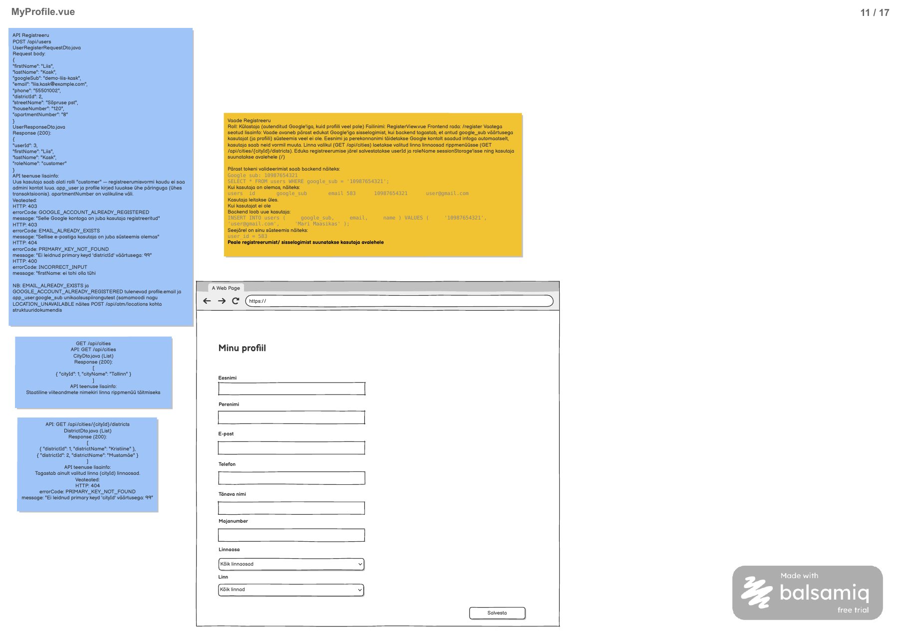

# Minu profiili täitmine ja muutmine

**Vaade:** `MyProfile.vue`, route `/my-profile` (taski tehniline ettepanek).

**Roll:** Google kaudu autenditud Customer/Admin, nii profiiliga kui profiilita.

**Vaste balsamic mockupis:** MyProfile.vue, lehekülg 11/17 failis [Laenukas.pdf](../../../balsamic/notes/Laenukas.pdf).



**Kasutaja kinnitatud ulatus:** profiili täitmine ja muutmine pärast Google sisselogimist. See asendab PDF-i vana RegisterView / POST /api/users / googleSub body / sessionStorage-põhise registreerimise kirjelduse. [Google autentimise task](../../backend/GoogleLoginView/Google-kontoga-sisselogimine.md) loob app_user juba sisselogimisel. Uued endpoint'id, DTO nimed ja `/my-profile` route on selle ülesande tehnilised lahendusettepanekud; need ei ole olemasolev API.

## Kasutajavoog

Pärast Google sisselogimist avatakse profiilita kasutajale MyProfile, olemasoleva profiiliga kasutaja avab sama vormi „Profiil“ kaudu. Vorm laadib nimed, kontaktid ja aadressi, kasutaja täiendab või muudab neid ning salvestab. Esmase täitmise järel värskendatakse ühist kasutajaolekut ja minnakse avalehele; muutmise järel jäädakse vormile teatega „Profiil salvestatud“ (muutmise käitumine on taski tehniline täpsustus). Registreerimine ja Google tokenite töötlemine jäävad autentimise ülesandesse.

## Kasutajaliidese elemendid

| Element | Tüüp | Kirjeldus/käitumine |
|---|---|---|
| Minu profiil | Pealkiri | PDF-i vormi pealkiri. |
| Eesnimi | Tekstiväli | Kohustuslik, kuni 100 märki; eeltäidetud ja muudetav. |
| Perenimi | Tekstiväli | Kuni 100 märki; tühja väärtust toetatakse Google ühe nimega kontode jaoks. |
| E-post | E-posti väli | Kohustuslik, korrektne e-post kuni 254 märki. |
| Telefon | Tekstiväli | Kohustuslik kuni 32 märki; ära kasuta arvu, mis kaotaks + või algusnullid. |
| Tänava nimi | Tekstiväli | Kohustuslik kuni 150 märki. |
| Majanumber | Tekstiväli | Kohustuslik kuni 20 märki. |
| Korterinumber | Tekstiväli | Valikuline kuni 20 märki. PDF body ja skeem sisaldavad seda, kuigi joonisel väli puudub; lisa andmete kadumise vältimiseks. |
| Linnaosa | Rippmenüü | Kohustuslik positiivne districtId valitud linna loendist. |
| Linn | Rippmenüü | Kohustuslik valik linnaosade laadimiseks. „Kõik linnad/linnaosad“ mockupi kohatäitjad pole profiili kehtivad väärtused. |
| Salvesta | Nupp | Valideerib ja saadab PUT; keelatud alglaadimisel/saatmisel. |
| Laadimise-, vea- ja eduteade | Teade | Eristab salvestamise ebaõnnestumist sessioonioleku värskendamise tõrkest. |

## Käitumine ja valideerimine

1. Kasuta ühist sessiooni; profiilita kasutaja suunamine sellele rajale ei tohi põhjustada router'i lõputut redirect'i. Ära määra autentimist sessionStorage userId/roleName olemasolu järgi.
2. `beforeMount` laadib GET /api/me/profile ja linnad. Olemasoleva profiili korral vali vastuse cityId, lae selle linnaosad ja alles seejärel taasta districtId. Algse eeltäitmise watcher ei tohi olemasolevat districtId-d nullida.
3. Kasutaja linna muutmine nullib linnaosa kohe ning laeb uue loendi. Linna puudumisel ära päringut tee; aegunud linna vastus ei tohi uuema valiku andmeid üle kirjutada. Linnaosadeta linn ei võimalda aadressi salvestada; kuva selgitus.
4. Profiili puudumisel kasuta GET eeltäidetud nime/e-posti; täida tühjad kontaktid ja aadress käsitsi. Profiilita hasProfile=false pole laadimisviga.
5. Valideeri allpool kirjeldatud PUT reeglid ja linnaosa valik. Saada täpselt request DTO väljad: ei userId-d, googleSub-i, cityId-d ega rolli. districtId peab olema arv, mitte rippmenüü tekst.
6. Edukas PUT annab värske profiili; uuenda vormi ning värskenda ühist /api/me kasutajaolekut olemasoleva autentimise teenusega. Esmatäitmine → avaleht, muutmine → sama vorm ja eduteade. /api/me värskenduse tõrge ei käivita uut PUT-i ega väida, et profiil jäi salvestamata.
7. Vea korral säilita kasutaja sisestus ja näita backend message'i tekstina. Saatmise ajal väldi topeltvajutust; finally lõpetab oleku. Võrguvea korral ära eelda error.response olemasolu ega korda salvestust automaatselt.
8. Kontaktide muutmine ei muuda Google konto e-posti ega isikutuvastuse sub väärtust. Rolli muutmise juhtnuppe ei lisata.

## API kutsed

**Backend task:** [Minu profiili haldamine](../../backend/MyProfile/Minu-profiili-haldamine.md). Teostus puudub; leping on kasutaja kinnitatud uue voolu jaoks koostatud selles taskis.

### `GET /api/me/profile`

Path/query parameetrid ja request body puuduvad. Kasutaja ID tuleb sessiooni principal'ist. `MyProfileResponseDto` — response 200:

```json
{
  "userId": 3,
  "hasProfile": true,
  "firstName": "Liis",
  "lastName": "Kask",
  "email": "liis.kask@example.com",
  "phone": "55501002",
  "districtId": 2,
  "streetName": "Sõpruse pst",
  "houseNumber": "120",
  "apartmentNumber": "8",
  "cityId": 1
}
```

Näide vastab `3_import.sql` Liisi profiilile ja asukohale. `userId`, `cityId`, `districtId` on Integer, `hasProfile` boolean, ülejäänud väljad String. `cityId` tuletatakse district.city_id kaudu, et frontend saaks linna ja linnaosa eeltäita.

Kui profiili veel pole, tagastatakse samuti 200: userId, firstName ja lastName olemasolevast app_user kirjest, email Google principal'ist ning hasProfile=false; phone, cityId, districtId, streetName, houseNumber ja apartmentNumber on null. See on vormi algolek, mitte 404. Puuduv Google email jääb nulliks ja kasutaja täidab selle vormil. Olemasoleva profiili korral kasutatakse alati salvestatud kontakte, mitte Google väärtustega ülekirjutamist.

### `PUT /api/me/profile`

Path/query parameetrid puuduvad. `MyProfileRequestDto` — request body:

```json
{
  "firstName": "Liis",
  "lastName": "Kask",
  "email": "liis.kask@example.com",
  "phone": "55501002",
  "districtId": 2,
  "streetName": "Sõpruse pst",
  "houseNumber": "120",
  "apartmentNumber": "8"
}
```

Response 200: sama täielik `MyProfileResponseDto` nagu GET näites, `hasProfile: true`. Esimesel salvestamisel luuakse olemasolevale app_user kirjele profile ja location; hiljem uuendatakse sama kasutaja profiili. PUT ei loo app_user kirjet ega muuda google_sub, rolli või staatust.

| Väli | Valideerimine |
|---|---|
| firstName | Kohustuslik mittetühi String, kuni 100 märki. |
| lastName | String kuni 100 märki; tühi on lubatud Google ühe nimega kontode jaoks. Puuduv/null normaliseeritakse tühjaks stringiks. |
| email | Kohustuslik mittetühi korrektne e-post, kuni 254 märki; ei tohi kuuluda teise kasutaja profiilile. Oma muutmata e-post on lubatud. |
| phone | Kohustuslik mittetühi String, kuni 32 märki; täiendavat riigipõhist mustrit ei kehtestata. |
| districtId | Kohustuslik positiivne Integer ja olemasolev district. |
| streetName | Kohustuslik mittetühi String, kuni 150 märki. |
| houseNumber | Kohustuslik mittetühi String, kuni 20 märki; mitte arv, et lubada nt tähelisi numbreid. |
| apartmentNumber | Valikuline String kuni 20 märki, tühi/puuduv väärtus normaliseeritakse nulliks. |

cityId kuulub GET vastusesse ja FE valikusse, mitte PUT body sisse: linn määratakse valitud district'i järgi. userId, profileId, locationId, googleSub, roleName, hasProfile ja ajatemplid ei ole kliendi muudetavad väljad. Mõlemad endpoint'id on ainult autenditud kasutajale, sh Adminile tema enda profiili jaoks.


**Veateated:**

| Päring | Status code | errorCode | message / body |
|---|---|---|---|
| GET/PUT | 401 | — | Tühi body; sessioon puudub või on aegunud. |
| PUT | 400 | INCORRECT_INPUT | <väli>: <valideerimise teade> |
| PUT | 403 | EMAIL_ALREADY_EXISTS | Sellise e-postiga kasutaja on juba süsteemis olemas |
| PUT | 404 | PRIMARY_KEY_NOT_FOUND | Ei leidnud primary keyd 'districtId' väärtusega: 123 |
| GET | 500 | INTERNAL_SERVER_ERROR | Profiili laadimine ebaõnnestus. Palun proovi hiljem uuesti. |
| PUT | 500 | INTERNAL_SERVER_ERROR | Profiili salvestamine ebaõnnestus. Palun proovi hiljem uuesti. |

```json
{
  "errorCode": "INCORRECT_INPUT",
  "message": "<väli>: <valideerimise teade>"
}
```

```json
{
  "errorCode": "EMAIL_ALREADY_EXISTS",
  "message": "Sellise e-postiga kasutaja on juba süsteemis olemas"
}
```

```json
{
  "errorCode": "PRIMARY_KEY_NOT_FOUND",
  "message": "Ei leidnud primary keyd 'districtId' väärtusega: 123"
}
```

```json
{
  "errorCode": "INTERNAL_SERVER_ERROR",
  "message": "Profiili laadimine ebaõnnestus. Palun proovi hiljem uuesti."
}
```

```json
{
  "errorCode": "INTERNAL_SERVER_ERROR",
  "message": "Profiili salvestamine ebaõnnestus. Palun proovi hiljem uuesti."
}
```

| Status code | errorCode | message | Frontend käitumine |
|---|---|---|---|
| 400 | INCORRECT_INPUT | Backend välja valideerimise tekst | Näita vormiviga, säilita väärtused. |
| 403 | EMAIL_ALREADY_EXISTS | Sellise e-postiga kasutaja on juba süsteemis olemas | Näita e-posti juures/alertis, hoia vorm avatuna. |
| 404 | PRIMARY_KEY_NOT_FOUND | Ei leidnud primary keyd 'districtId' väärtusega: 123 | Näita viga ja värskenda linnaosa valikuid. |
| 401 | — | Tühi body | Käivita ühine aegunud sessiooni käsitlus. |
| 500 | INTERNAL_SERVER_ERROR | Vastava GET/PUT päringu message ülal | Näita laadimise/salvestamise viga. |
| Muu 403 | — | Määramata, nt CSRF | Üldine ligipääsu/sessiooni viga, mitte e-posti konflikt. |
| Vastus puudub | — | Üldine võrguvea tekst | Säilita vorm, võimalda korduskatse. |

### `GET /api/cities`

**Backend task:** [Linnade-nimekirja-paring](../../backend/ToolsView/Linnade-nimekirja-paring.md).

Teenusel puuduvad sisendid. Path variable'id, query parameetrid ja request body puuduvad. Päring on avalik: ToolsView märkmetes on lubatud Admin, Customer ja Külastaja.

**Response (200 OK):** `List<CityDto>`, JSON massiiv kõigist viiteandmete kirjetest.

```json
[
  {
    "cityId": 1,
    "cityName": "Tallinn"
  },
  {
    "cityId": 2,
    "cityName": "Tartu"
  },
  {
    "cityId": 3,
    "cityName": "Pärnu"
  }
]
```

`CityDto.java` sisaldab ainult `Integer cityId` ja `String cityName`. Need vastavad tabeli `city` väljadele `id` ja `city_name`. Lehekülgjaotust pole.

PDF-is on loendi esimene element ja jätkumist tähistav `...`; siin on täielik vastus [3_import.sql](../../../database/3_import.sql) andmetega. Järjestus on `city.id ASC`. PDF ei määra sortimist; ID-järjestus on taski tehniline täpsustus korratavaks vastuseks.

Tühja tabeli korral tagastada HTTP 200 ja `[]`, mitte `null` või 404. Andmed loetakse andmebaasist, mitte koodi kirjutatud loendist.

PDF-is on „Veateated: —”. Allolev 500 on taski tehniline täpsustus. Sisendita avaliku loendi jaoks ei lisata 400/401/403/404 ärivigu.

| Olukord | Status code | Response body |
|---|---|---|
| Andmebaasipäring ebaõnnestub ootamatult. | 500 Internal Server Error | `{"errorCode":"INTERNAL_SERVER_ERROR","message":"Linnade laadimine ebaõnnestus. Palun proovi hiljem uuesti."}` |

Kasuta olemasoleva `ApiError` kuju: `message` ja `errorCode` on String-väljad. Praegune `RestExceptionHandler` ei taga veel seda 500 lepingut. SQL-i ega stack trace'i kliendile ei tagastata.

### `GET /api/cities/{cityId}/districts`

**Backend task:** [Valitud-linna-linnaosade-paring](../../backend/ToolsView/Valitud-linna-linnaosade-paring.md).

| Parameeter | Asukoht | Java tüüp | Kohustuslik | Tähendus |
|---|---|---|---|---|
| `cityId` | Path variable | `Integer` | Jah | Valitud linna `city.id`. |

Query parameetrid ja request body puuduvad. Päring on avalik kõigile ToolsView rollidele, sh külalisele. Näide: `GET /api/cities/1/districts`.

`cityId` peab olema Java Integer-iks teisendatav. See on konkreetse linna ID: erinevalt tööriistade otsingu valikulisest filtrist ei tähenda siin `0` filtri ignoreerimist. Kui vastavat linna pole, tagastada 404.

**Response (200 OK):** `List<DistrictDto>`, ainult valitud linna linnaosad. Näide Tallinna (`cityId = 1`) kohta:

```json
[
  {
    "districtId": 1,
    "districtName": "Kristiine"
  },
  {
    "districtId": 2,
    "districtName": "Mustamäe"
  },
  {
    "districtId": 3,
    "districtName": "Haabersti"
  },
  {
    "districtId": 4,
    "districtName": "Kesklinn"
  },
  {
    "districtId": 5,
    "districtName": "Lasnamäe"
  },
  {
    "districtId": 6,
    "districtName": "Nõmme"
  },
  {
    "districtId": 7,
    "districtName": "Pirita"
  },
  {
    "districtId": 8,
    "districtName": "Põhja-Tallinn"
  }
]
```

`DistrictDto.java` sisaldab ainult `Integer districtId` ja `String districtName`, vastavalt `district.id` ning `district.district_name`. PDF-i lühendatud näide on laiendatud kõigi Tallinna linnaosadega failist [3_import.sql](../../../database/3_import.sql).

Tagastada kõik `district.city_id = cityId` kirjed. PDF ei määra sortimist; taski tehniline täpsustus on `district.id ASC`, ilma lehekülgjaotuseta. Olemasoleva linna tühi linnaosaloend annab 200 ja `[]`; puuduv linn annab 404. Neid olukordi tuleb eristada linna olemasolu kontrolliga.

404 leping pärineb PDF-ist; 400 ja 500 on sisendi ning tehnilise tõrke käsitlemise täpsustused. Vastuse kuju on olemasolev `ApiError` (`message`, `errorCode`).

| Olukord | Status code | Response body |
|---|---|---|
| Linn `cityId = 123` puudub. Muu puuduva ID puhul kasutada teates tegelikku väärtust. | 404 Not Found | `{"errorCode":"PRIMARY_KEY_NOT_FOUND","message":"Ei leidnud primary keyd 'cityId' väärtusega: 123"}` |
| `cityId` pole täisarv või ei mahu Java Integer vahemikku. | 400 Bad Request | `{"errorCode":"INCORRECT_INPUT","message":"cityId: peab olema Integer-tüüpi täisarv"}` |
| Andmebaasipäring ebaõnnestub ootamatult. | 500 Internal Server Error | `{"errorCode":"INTERNAL_SERVER_ERROR","message":"Linnaosade laadimine ebaõnnestus. Palun proovi hiljem uuesti."}` |

404 saab anda olemasoleva `PrimaryKeyNotFoundException` kaudu. Path variable'i teisendamise 400 ja ühtne 500 kuju tuleb teostamisel tagada; praegune väljade valideerimise handler ei taga neid automaatselt. SQL-i ega stack trace'i ei tagastata.

Linnade/linnaosade 400/404/500 korral kuva vastav message ja peata sõltuv valik; tühi loend on eraldi olek. GET /api/me sessioonikontroll kuulub GoogleLoginView ühisesse autentimise teostusse ja seda ei dubleerita uue profiili endpoint'iga.

## Komponendid ja failistruktuur

- `frontend/src/views/MyProfile.vue`: uus vaade, laadimine ja salvestuse tulemused.
- `frontend/src/components/forms/MyProfileForm.vue`: väljad ja valideerimine, event-save.
- `frontend/src/api-services/ProfileService.js`: GET/PUT /api/me/profile.
- `frontend/src/api-services/CityService.js`: taaskasuta ToolsView jaoks kavandatud linnade/linnaosade teenust.
- `frontend/src/components/common/AlertDanger.vue`: ühine tekstiline viga.
- `frontend/src/router/index.js`: lisa /my-profile ja seosta profiilita kasutaja suunamine ühise OAuth vooga; praegu olemas ainult / ja /test.
- `frontend/src/navigation/`: Profiil link, esmatäitmise järel avalehele suunamine.

Nimetatud profiilikomponendid ja teenused puuduvad. Järgi Options API-t ja projekti frontend dokumente: beforeMount, data/computed/methods, event- sündmused ning .then()/.catch()/.finally() eraldi handle-meetoditega.

## Vastuvõtu kriteeriumid

- [ ] Profiilita ja profiiliga Google kasutaja kasutavad sama vormi ilma uuesti registreerimata.
- [ ] Eeltäitmine taastab ka linna ja linnaosa; kasutaja linna muutmine tühjendab vana linnaosa.
- [ ] Kõik nime-, kontakti- ja aadressiväljad, sh valikuline korterinumber, on toetatud.
- [ ] Valideerimine vastab BE piiridele; tühi perekonnanimi on lubatud, linn/linnaosa pole „kõik“ väärtusega salvestatavad.
- [ ] PUT ei sisalda kasutaja ID-d, rolli ega googleSub-i.
- [ ] Esmatäitmine uuendab hasProfile oleku ja viib avalehele; muutmine näitab eduteadet samal vormil.
- [ ] Duplikaat-e-post, puuduv district, aegunud sessioon, GET/PUT ja võrguvead on kontrollitud, sisestus säilib.
- [ ] Korduv vajutus ja aegunud linnaosavastus ei tekita valesid salvestusi/valikuid.
