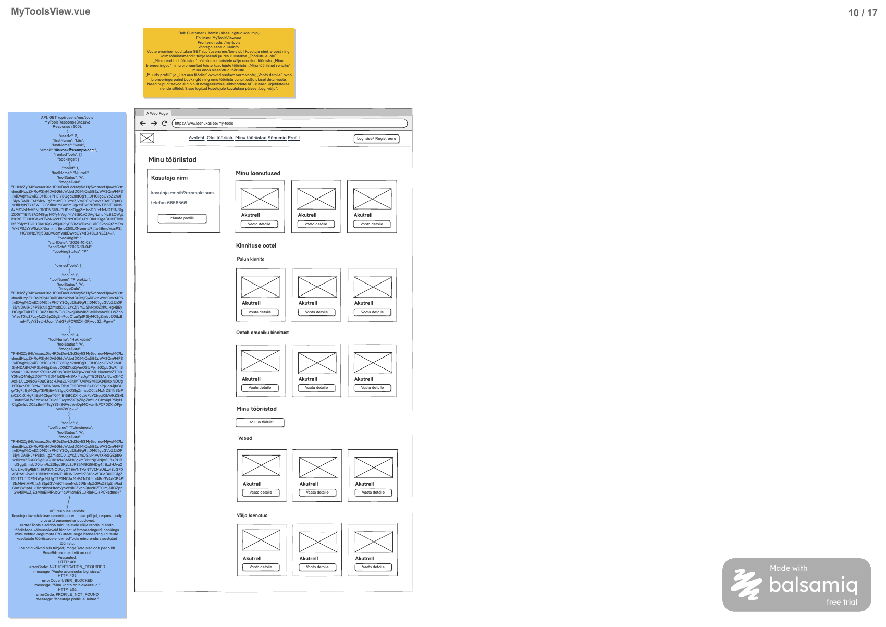

# Minu tööriistade ja taotluste ülevaade

**Vaade:** `MyToolsView.vue`, route `/my-tools`

**Roll:** Customer / Admin, sisse logitud kasutaja.

**Vaste balsamic mockupis:** MyToolsView.vue, lehekülg 10/17 failis [Laenukas 2509.pdf](../../../balsamic/notes/Laenukas%202509.pdf).



**Kasutaja juhis:** lähtuda kujundusest; kollane silt on aegunud. Seetõttu on aluseks viis kujunduses nähtavat rühma, mitte vana märkme kolm loendit. Ka sinise sildi kolme loendiga vastust tuleb nende rühmade jaoks laiendada. Allolev viie loendiga DTO on taski tehniline ettepanek, mitte olemasolev realisatsioon. [MyToolsView märkmed](../../../balsamic/notes/MyToolsView-markmed.md) jäävad ajalooliseks allikaks; neid selles töös ei muudeta.

## Kasutajavoog

Kasutaja avab Minu tööriistad ja näeb vasakul oma kontaktikaarti ning paremal viit tööriistade/taotluste rühma. Ta avab kaardilt detailvaate, profiilinupust MyProfile või lisamisnupust AddToolView. Omanikule saabunud ootel taotluse detail viib kinnitamise vaatesse, siin taotlust veel ei kinnitata. Ajalugu ja kujunduses puuduvad tulevaste kinnitatud broneeringute/U tööriistade eraldi rühmad ei kuulu sellesse taski.

## Kasutajaliidese elemendid

| Element | Tüüp | Kirjeldus/käitumine |
|---|---|---|
| Päis ja Minu tööriistad pealkiri | Ühine navigatsioon | Avaleht, Otsi tööriistu, Minu tööriistad, Sõnumid, Profiil. Autenditud kasutajal Logi välja; pildi Logi sisse nupp ei käivita uut autentimist. |
| Kasutaja nimi, e-post, telefon | Profiilikaart | Vastuse firstName/lastName, email ja phone; mockupi näidisväärtusi ei hardcode'ita. |
| Muuda profiili | Nupp | `/my-profile`, MyProfile taski route. |
| Minu laenutused | Kaardirühm | myRentals. |
| Kinnituse ootel → Palun kinnita | Kaardirühm | incomingRequests, mulle kui omanikule saabunud P taotlused. |
| Kinnituse ootel → Ootab omaniku kinnitust | Kaardirühm | outgoingRequests, minu saadetud P taotlused. |
| Minu tööriistad → Vabad | Kaardirühm | availableTools. |
| Minu tööriistad → Välja laenatud | Kaardirühm | rentedOutTools. |
| Lisa uus tööriist | Nupp | `/tools/new`; Customerile vastavalt AddToolView lepingule. Admini jaoks selle tegevuse lubamine vajab AddToolView rollilepingu laiendamist. |
| Pilt ja tööriista nimi | Kaardi sisu | imageData ja toolName; puuduva/vigase pildi korral kohatäitja. |
| Vaata detaile | Kaardi nupp | Broneeringurühmades bookingId järgi, Vabad rühmas toolId järgi. |
| Laadimine, viga, tühi rühm | Olek | Tühjas rühmas „Tööriistu ei ole“. Viga ei muutu viieks tühjaks loendiks. |

Paigutus järgib pilti: profiilikaart vasakul, rühmad paremal, laiema ekraani ridades kolm kaarti; kitsamal ekraanil vähem veerge. Tegelik kaartide arv sõltub andmetest, mitte mockupi kolmest näidisest. Paginatsiooni või otsekaartidel kinnitamise/kustutamise nuppe ei lisata.

## Käitumine ja valideerimine

1. Oota ühise sessiooni selgumist ja käivita GET beforeMount kaudu. Customer/Admin roll ega userId ei tule usaldatud kujul sessionStorage'ist.
2. Hoia response'i viis loendit eraldi; ära tõlgenda vana API kolme loendit ümber. Server filtreerib kuupäevad Europe/Tallinn järgi; brauser ei arvuta neid ümber kohaliku ajavööndi järgi.
3. Kuva kõik rühmade pealkirjad ka tühjal juhul. Broneeringukaardi key on bookingId, Vabad kaardil toolId. Sama tööriista erinevaid taotlusi ei liideta üheks kaardiks.
4. „Vaata detaile“: incomingRequests → BookingApprovalView bookingId-ga; myRentals/outgoingRequests/rentedOutTools → broneeringu detailvaade bookingId-ga. AvailableTools → `/tools/<toolId>`. Broneeringuvaadete täpsed route'id pole veel teostatud ega kokku lepitud: kasuta navigeerimisteenuse eraldi meetodeid ning seo need detailtaskide käigus, ära asenda bookingId-d toolId-ga.
5. „Muuda profiili“ → /my-profile; „Lisa uus tööriist“ → /tools/new Customer rolliga. Adminile ära näita toimivat lisamisnuppu kuni sihtvaate Customer-only leping on laiendatud; see on nähtav integratsioonipiirang, mitte backend'i õiguste möödahiilimine.
6. 401 korral kasuta ühist sisselogimist; 403 USER_BLOCKED korral kuva sõnum ja peata tegevused. 404 PROFILE_NOT_FOUND korral ava profiili täitmise voog. 500/võrguvea korral kuva viga ja võimalda uuesti laadida.
7. Ära eelda error.response olemasolu. Korduspäringute korral ei tohi vana vastus uut üle kirjutada; lõpeta õige päringu laadimisolek finally kaudu. Kui kasutaja lahkub ja naaseb pärast profiili lisamist/taotluse muutmist, lae värske ülevaade.
8. Pilt on prefiksita Base64; impordis SVG. Ära sisesta dekodeeritud SVG-d v-html abil. Puuduv/vigane pilt ei peida tööriista; muude failiformaatide MIME-leping on AddToolView-ga ühine lahtine detail.

Allpool olevad kuupäevareeglid on backend taski tehnilised täpsustused, mitte kujundusest loetavad kindlad nõuded:

| UI rühm | DTO loend | Valikureegel |
|---|---|---|
| Minu laenutused | myRentals | booking.renter_id = sessiooni kasutaja, tool.owner_id != kasutaja, booking.status=C, start_date <= täna <= end_date. |
| Kinnituse ootel → Palun kinnita | incomingRequests | tool.owner_id = kasutaja, booking.renter_id != kasutaja, booking.status=P, end_date >= täna. |
| Kinnituse ootel → Ootab omaniku kinnitust | outgoingRequests | booking.renter_id = kasutaja, tool.owner_id != kasutaja, booking.status=P, end_date >= täna. |
| Minu tööriistad → Vabad | availableTools | tool.owner_id = kasutaja, tool.status=A ning puudub praegu kehtiv C broneering. |
| Minu tööriistad → Välja laenatud | rentedOutTools | tool.owner_id = kasutaja, teise kasutaja booking.status=C, start_date <= täna <= end_date. Tool.status ei asenda broneeringu kontrolli. |

Kuupäeva- ja olekureeglid on kujunduse põhjal tehtud tehnilised täpsustused: PDF näitab rühmade nimetusi, kuid ei määra piirpäevi. „Täna“ võetakse üks kord päringu alguses serveri Europe/Tallinn ajavööndis. Algus- ja lõpppäev loetakse perioodi sisse.

Esimeses, teises, kolmandas ja viiendas loendis on üks kaart broneeringu kohta (`bookingId`); neljandas üks kaart tööriista kohta (`toolId`). Sama tööriista mitu taotlust ei tohi kaduda grupeerimise tõttu. Vaba tööriist võib olla ka ootel taotluste loendis: P ei ole kinnitatud laenutus. Ükski praegu välja laenatud tööriist ei ole samal ajal Vabad rühmas.

Broneeringuloendite järjestus: start_date ASC, booking.id ASC. Vabad: tool.created_at DESC, tool.id DESC. Tagastatakse kõik sobivad kirjed ilma paginatsioonita, sest kujunduses lehevahetust ei ole. Kõik tühjad loendid on [], mitte null.

**Kujundusega katmata olukorrad:** tulevane kinnitatud broneering ei kuulu praeguste laenutuste rühma; U tööriist ilma käimasoleva C broneeringuta ei kuulu Vabad ega Välja laenatud rühma. Käesolev leping jätab need sellest ülevaatest välja ja ei nimeta neid ekslikult vabaks või ootel olevaks. Nende eraldi kuvamine vajab edasist tooteotsust; neid ei kustutata andmebaasist. Tagasilükatud ja lõppenud taotlusi samuti selles vaates ei näidata.

## API kutsed

**Backend task:** [Minu tööriistade ülevaade](../../backend/MyToolsView/Minu-tooriistade-ulevaade.md). Realisatsioon puudub; leping on koostatud uue kujunduse järgi.

### `GET /api/users/me/tools`

Path/query parameetrid ja request body puuduvad. Kasutaja määratakse serveri sessioonist; ka Admin näeb enda andmeid, mitte kogu süsteemi loendit. Endpoint'i aadress säilib siniselt sildilt.

**Response 200:** `MyToolsResponseDto`:

```json
{
  "userId": 3,
  "firstName": "Liis",
  "lastName": "Kask",
  "email": "liis.kask@example.com",
  "phone": "55501002",
  "myRentals": [],
  "incomingRequests": [],
  "outgoingRequests": [
    {
      "toolId": 1,
      "toolName": "Akutrell",
      "toolStatus": "A",
      "imageData": "PHN2ZyB4bWxucz0iaHR0cDovL3d3dy53My5vcmcvMjAwMC9zdmciIHdpZHRoPSIyNDAiIGhlaWdodD0iMjQwIiB2aWV3Qm94PSIwIDAgMjQwIDI0MCI+PHJlY3Qgd2lkdGg9IjI0MCIgaGVpZ2h0PSIyNDAiIHJ4PSIxNiIgZmlsbD0iI2YxZjVmOSIvPjxwYXRoIGZpbGw9IiMyNTYzZWIiIGQ9Ik01MCA2MGgxMDV2NDVINTB6IE04NSAxMDVoMzV2NjBIODV6XCIvPjxwYXRoIGZpbGw9IiMzMzQxNTUiIGQ9Ik0xNTUgNzBoMjV2MjVoLTI1eiBNMTgwIDc4aDMwdjloLTMweiBNNzAgMTU1aDY1djE1SDcwelwiLz48dGV4dCB4PSIxMjAiIHk9IjIxNSIgdGV4dC1hbmNob3I9Im1pZGRsZSIgZm9udC1mYW1pbHk9InNhbnMtc2VyaWYiIGZvbnQtc2l6ZT0iMjAiIGZpbGw9IiMwZjE3MmEiPkFrdXRyZWxsPC90ZXh0Pjwvc3ZnPg==",
      "bookingId": 1,
      "startDate": "2026-10-02",
      "endDate": "2026-10-04",
      "bookingStatus": "P"
    }
  ],
  "availableTools": [
    {
      "toolId": 8,
      "toolName": "Projektor",
      "toolStatus": "A",
      "imageData": "PHN2ZyB4bWxucz0iaHR0cDovL3d3dy53My5vcmcvMjAwMC9zdmciIHdpZHRoPSIyNDAiIGhlaWdodD0iMjQwIiB2aWV3Qm94PSIwIDAgMjQwIDI0MCI+PHJlY3Qgd2lkdGg9IjI0MCIgaGVpZ2h0PSIyNDAiIHJ4PSIxNiIgZmlsbD0iI2YxZjVmOSIvPjx0ZXh0IHg9IjEyMCIgeT0iMTI1IiB0ZXh0LWFuY2hvcj0ibWlkZGxlIiBmb250LWZhbWlseT0ic2Fucy1zZXJpZiIgZm9udC1zaXplPSIyMCIgZmlsbD0iIzBmMTcyYSI+UHJvamVrdG9yPC90ZXh0Pjwvc3ZnPg=="
    },
    {
      "toolId": 4,
      "toolName": "Hekikäärid",
      "toolStatus": "A",
      "imageData": "PHN2ZyB4bWxucz0iaHR0cDovL3d3dy53My5vcmcvMjAwMC9zdmciIHdpZHRoPSIyNDAiIGhlaWdodD0iMjQwIiB2aWV3Qm94PSIwIDAgMjQwIDI0MCI+PHJlY3Qgd2lkdGg9IjI0MCIgaGVpZ2h0PSIyNDAiIHJ4PSIxNiIgZmlsbD0iI2YxZjVmOSIvPjxnIGZpbGw9Im5vbmUiIHN0cm9rZS13aWR0aD0iMTAiPjxwYXRoIHN0cm9rZT0iIzY0NzQ4YiIgZD0iTTY1IDM1bDEwNSAxMzUgTTE3NSAzNUw3MCAxNzBcIi8+PHBhdGggc3Ryb2tlPSIjZWE1ODBjIiBkPSJNMTQ1IDE0MGwyNSAzMCBNOTUgMTQwbC0yNSAzMFwiLz48L2c+PGNpcmNsZSBjeD0iMTIwIiBjeT0iMTA1IiByPSI5IiBmaWxsPSIjMzM0MTU1XCIvPjx0ZXh0IHg9IjEyMCIgeT0iMjE1IiB0ZXh0LWFuY2hvcj0ibWlkZGxlIiBmb250LWZhbWlseT0ic2Fucy1zZXJpZiIgZm9udC1zaXplPSIyMCIgZmlsbD0iIzBmMTcyYSI+SGVraWvDpMOkcmlkPC90ZXh0Pjwvc3ZnPg=="
    },
    {
      "toolId": 3,
      "toolName": "Tolmuimeja",
      "toolStatus": "A",
      "imageData": "PHN2ZyB4bWxucz0iaHR0cDovL3d3dy53My5vcmcvMjAwMC9zdmciIHdpZHRoPSIyNDAiIGhlaWdodD0iMjQwIiB2aWV3Qm94PSIwIDAgMjQwIDI0MCI+PHJlY3Qgd2lkdGg9IjI0MCIgaGVpZ2h0PSIyNDAiIHJ4PSIxNiIgZmlsbD0iI2YxZjVmOSIvPjxwYXRoIGZpbGw9IiMwZDk0ODgiIGQ9Ik02NSA5MGgxMDB2NjBINjV6XCIvPjxwYXRoIGZpbGw9Im5vbmUiIHN0cm9rZT0iIzBkOTQ4OCIgc3Ryb2tlLXdpZHRoPSIxNSIgZD0iTTg1IDkwVjU1aDU1djM1XCIvPjxwYXRoIHN0cm9rZT0iIzMzNDE1NSIgc3Ryb2tlLXdpZHRoPSI4IiBkPSJNNTUgMTU1aDEyNSBNMTUwIDEzMHY0NVwiLz48dGV4dCB4PSIxMjAiIHk9IjIxNSIgdGV4dC1hbmNob3I9Im1pZGRsZSIgZm9udC1mYW1pbHk9InNhbnMtc2VyaWYiIGZvbnQtc2l6ZT0iMjAiIGZpbGw9IiMwZjE3MmEiPlRvbG11aW1lamE8L3RleHQ+PC9zdmc+"
    }
  ],
  "rentedOutTools": []
}
```

Näide on [3_import.sql](../../../database/3_import.sql) Liis Kask (`userId=3`) fikseeritud testkuupäeval **25.09.2026**, mitte dünaamiline tänase päeva ootus. Broneering 1 Akutrellile on P; Redeli broneering 2 lõppes 21.09; Hekikääride broneering 3 on R. Seetõttu on näites ainult üks outgoingRequests kirje ja kolm vaba oma tööriista. Pildistringid on kodeeritud otse impordi SVG baitidest, nende sisu parandamata.

`MyToolsResponseDto`: Integer userId; String firstName, lastName, email, phone; neli List<MyToolBookingDto> loendit (myRentals, incomingRequests, outgoingRequests, rentedOutTools) ning List<MyToolCardDto> availableTools.

`MyToolCardDto`: Integer toolId; String toolName, toolStatus, imageData. `MyToolBookingDto` sisaldab samu välju ning lisaks Integer bookingId, LocalDate startDate/endDate ja String bookingStatus. imageData on ainult is_main=true pildi Base64 ilma data-URL prefiksita; puuduva peapildi korral null. Lisapilti ei valita automaatselt asemele. Telefon lisatakse profile.phone kaudu, sest see on kujunduses nähtav, kuid vanas API näites puudub.


**Veateated:**

| Status code | errorCode | message | Frontend käitumine |
|---|---|---|---|
| 401 | AUTHENTICATION_REQUIRED | Vaate avamiseks logi sisse. | Ühine sisselogimise käsitlus. |
| 403 | USER_BLOCKED | Sinu konto on blokeeritud. | Kuva viga ja peata selle vaate tegevused. |
| 404 | PROFILE_NOT_FOUND | Kasutaja profiili ei leitud. | Kuva teade ja suuna MyProfile täitmise voogu. |
| 500 | INTERNAL_SERVER_ERROR | Minu tööriistade laadimine ebaõnnestus. Palun proovi hiljem uuesti. | Kuva laadimisviga ja võimalda korduskatse. |

```json
{
  "errorCode": "AUTHENTICATION_REQUIRED",
  "message": "Vaate avamiseks logi sisse."
}
```

```json
{
  "errorCode": "USER_BLOCKED",
  "message": "Sinu konto on blokeeritud."
}
```

```json
{
  "errorCode": "PROFILE_NOT_FOUND",
  "message": "Kasutaja profiili ei leitud."
}
```

```json
{
  "errorCode": "INTERNAL_SERVER_ERROR",
  "message": "Minu tööriistade laadimine ebaõnnestus. Palun proovi hiljem uuesti."
}
```

Muuda profiili, Lisa uus tööriist ja Vaata detaile teevad siin navigatsiooni; nende sihtvaadete API-d ei dubleerita.

## Komponendid ja failistruktuur

- `frontend/src/views/MyToolsView.vue`: laadimine, vastuse viis loendit ja navigeerimise handler'id.
- `frontend/src/components/common/MyToolsSection.vue`: pealkiri, kaardid ja tühja oleku tekst.
- `frontend/src/components/common/MyToolCard.vue`: pilt/nimi ja event-view-details, toolId/bookingId eristamine.
- `frontend/src/components/common/UserProfileCard.vue`: nimi, kontaktid ja event-edit-profile.
- `frontend/src/api-services/MyToolsService.js`: üks GET /api/users/me/tools.
- `frontend/src/navigation/NavigationService.js`: eraldi tööriista-, broneeringu- ja kinnitamisvaate sihid.
- `frontend/src/router/index.js`: lisa /my-tools; praegu olemas ainult / ja /test.

Need komponendid/teenused puuduvad. Järgi projekti frontend struktuuri ja Options API-t: beforeMount, eraldi data/computed/methods, event- sündmused ning .then()/.catch()/.finally() koos handle-meetoditega. Jagatud alerti ja navigeerimist ära dubleeri.

## Vastuvõtu kriteeriumid

- [ ] Vaade sisaldab profiili telefoni ning kõiki viit kujunduse rühma õiges hierarhias.
- [ ] Rühmad kuvatakse eraldi serveri loenditest; mitu sama tööriista taotlust säilivad eraldi.
- [ ] Iga tühi rühm näitab „Tööriistu ei ole“, API viga on eraldi.
- [ ] Kaardi detailitegevus kasutab õiget bookingId/toolId-d ja sihtvaadet; puuduvad route'id on enne integratsiooni kontrolli teostatud.
- [ ] Profiili ja tööriista lisamise navigatsioon vastab sihtvaate õigustele.
- [ ] Puuduv/vigane pilt, 401/403/404/500 ja võrguviga on käsitletud ilma vale tühja/eduka tulemuseta.
- [ ] Pärast tagasipöördumist värskendatakse andmed; aegunud päring ei kirjuta uuemaid andmeid üle.
- [ ] Testkontroll kasutab 25.09.2026 fikseeritud BE näidet ning eraldi kõigi viie rühma täidetud testandmeid.
