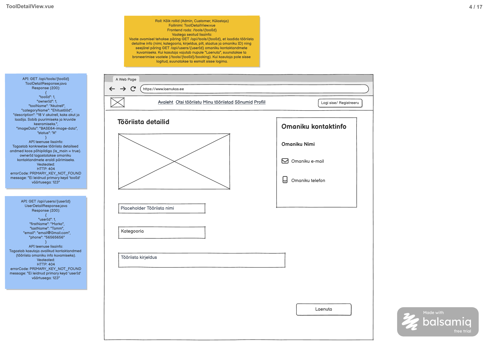

# Tööriista detailvaade

**Vaade:** `ToolDetailView.vue`, route `/tools/{toolId}`

**Roll:** Kõik rollid (Admin, Customer, Külastaja)

**Vaste balsamic mockupis:** "ToolDetailView.vue", lehekülg 4/17 failis [Laenukas2509.pdf](../../../balsamic/notes/Laenukas2509.pdf) (vt lisatud pilt `Tooriista-detailvaade.png`)



Allikas: silt [ToolDetailView-markmed.md](../../../balsamic/notes/ToolDetailView-markmed.md). PDF-i sildil on omaniku kontaktid veel „avalikud“; märkmefaili järgi (alus) küsitakse ja kuvatakse neid ainult sisse logitud kasutajale.

## Kasutajavoog

Kasutaja avab vaate ToolsView kaardi nupust „Vaata detaile“ (`/tools/{toolId}`). Vaate avamisel laaditakse tööriista andmed (pilt, nimi, kategooria, kirjeldus, staatus, omaniku ID). Sisse logitud kasutajale laaditakse seejärel omaniku kontaktandmed ja kuvatakse kastis „Omaniku kontaktinfo“; külastajale kontakte ei küsita ega kuvata. Nupp „Laenuta“ viib sisse logitud kasutaja broneerimise vormile (`/tools/{toolId}/booking`); külastaja suunatakse esmalt sisse logima. Mockupil olev lehekülgede riba („‹ Eelmine 1 2 3 4 5 Järgmine›“) ei ole sildis ega API-s kirjeldatud ja jääb selle taski skoobist välja.

## Kasutajaliidese elemendid

| Element | Tüüp | Kirjeldus/käitumine |
|---|---|---|
| „Tööriista detailid“ | Pealkiri | Vaate pealkiri. |
| Veateade | `AlertDanger.vue` | Backendi `message` või üldine veateade. Peidetud, kui viga pole. |
| Tööriista pilt | Pilt | `imageData` (Base64) → ``. `imageData = null` korral kohatäitja (nt Bootstrap ikoon/hall kast). MIME-tüüp vt lahtine ots allpool. |
| Tööriista nimi | Tekst (kirjutuskaitstud) | `toolName`. Mockupil sisendkasti moodi, kuid vaade ainult kuvab. |
| Kategooria | Tekst (kirjutuskaitstud) | `categoryName`. |
| Tööriista kirjeldus | Tekst (kirjutuskaitstud) | `description`; `null` korral tühi või „Kirjeldus puudub“. |
| Saadavuse teade | Teade | Kui `status = "U"`, näita „Tööriist pole hetkel saadaval“. Mockupil pole; tuleneb `status` väljast (vt lahtine ots). |
| „Omaniku kontaktinfo“ | Kast | Nähtav **ainult sisse logitud kasutajale**. |
| Omaniku nimi | Tekst | `firstName` + `" "` + `lastName`. |
| Omaniku e-mail | `mailto:` link ümbrikuikooniga | `email`; `null` korral rida peidetud. |
| Omaniku telefon | `tel:` link telefoniikooniga | `phone`; `null` korral rida peidetud. |
| Lehekülgede riba | Navigatsioon | **Skoobist väljas** (vt Kasutajavoog). |
| „Laenuta“ | Nupp | Sisse logitud → `/tools/{toolId}/booking`; külastaja → sisselogimine. Oma tööriista puhul keelatud koos selgitusega „See on sinu tööriist. Oma tööriista laenutada ei saa.“ |

## Käitumine ja valideerimine

1. **Avamine (`beforeMount`):** loe `toolId` rajast (`this.$route.params.toolId`) ja kutsu `GET /api/tools/{toolId}`.
2. **Tööriista vastus:** täida pilt, nimi, kategooria, kirjeldus ja staatus. Kui kasutaja on sisse logitud (ühine kasutajaolek, vt allpool), kutsu `GET /api/users/{ownerId}`.
3. **Külastaja:** omaniku päringut ei tehta ja kontaktikasti ei renderdata.
4. **Omaniku vastus:** täida kontaktikast. Profiilita omanikul on `email` ja `phone` `null` — peida vastavad read, nimi jääb.
5. **„Laenuta“ sisse logitud kasutajale:** `router.push` rajale `/tools/{toolId}/booking` (BookingFormView). Broneerimise piirangud (oma tööriist, `status = "U"`, kattuvad perioodid) kontrollib BookingFormView ja backend.
6. **„Laenuta“ külastajale:** käivita ühine sisselogimise voog (GoogleLoginView taski `GoogleLoginModal.vue`, mille link on `/oauth2/authorization/google`). Backend suunab pärast sisselogimist avalehele `/` (`googlega_login.md`: `defaultSuccessUrl`), seega tööriista lehele tagasi automaatselt ei jõuta.
7. **Laadimise olek:** kuni tööriista vastus pole saabunud, näita laadimise olekut; „Laenuta“ on keelatud.
8. **Vead:** vt API veatabelid. Omaniku päringu viga ei peida tööriista andmeid — ainult kontaktikast jääb tühjaks/veateatega.

**Kasutajaga kinnitatud otsused (varem lahtised otsad):**
- **Pildi MIME-tüüp:** eeldatakse `image/svg+xml` (impordipildid on SVG); `ToolImage.vue` näitab kuvamisvea korral kohatäitjat. Üldine MIME-leping jääb eraldi täpsustuseks.
- **Saadavuse teade ja „Laenuta“ `status = "U"` korral:** näidatakse teadet „Tööriist pole hetkel saadaval“; nupp jääb aktiivseks ja BookingFormView keelab saatmise.
- **Oma tööriist:** kui sisse logitud kasutaja `userId` (`GET /api/me`) = `ownerId`, on „Laenuta“ keelatud ja selle all on selgitus „See on sinu tööriist. Oma tööriista laenutada ei saa.“
- **E-posti ja telefoni link:** `OwnerContactCard.vue` kuvab e-maili `mailto:` ja telefoni `tel:` lingina.
- **Tagasipöördumine pärast sisselogimist:** praegu ei muudeta — külastaja jõuab pärast sisselogimist avalehele (`auth/loginReturnPath.js` lubab ainult `/bookings/<id>` radu).

## API kutsed

### `GET /api/tools/{toolId}`

**Backend task:** vt [docs/tasks/backend/ToolDetailView/Tooriista-detailide-paring.md](../../backend/ToolDetailView/Tooriista-detailide-paring.md). Realiseeritud: `ToolController.getToolDetail`. Päring on **avalik** (ka külastajale).

Sisend: path variable `toolId` (Integer). Request body puudub.

`ToolDetailResponse.java` — response (200):
```json
{
  "toolId": 1,
  "ownerId": 1,
  "toolName": "Akutrell",
  "categoryName": "Ehitustööd",
  "description": "18 V akutrell, kaks akut ja laadija. Sobib puurimiseks ja kruvide keeramiseks.",
  "imageData": "BASE64-image-data",
  "status": "A"
}
```

`imageData` on põhipildi (`is_main = true`) baitide Base64 kuju ilma `data:` prefiksita, pildita tööriistal `null`. `status`: `A` = saadaval, `U` = pole saadaval. `description` võib olla `null`.

**Veateated:**

| Status code | errorCode | message | Frontend käitumine |
|---|---|---|---|
| 404 | PRIMARY_KEY_NOT_FOUND | „Ei leidnud primary keyd 'toolId' väärtusega: 123“ | Näita `message`; tööriista andmeid ja „Laenuta“ nuppu ei kuvata. |
| 400 | INCORRECT_INPUT | „toolId: peab olema Integer-tüüpi täisarv“ | Rajal ei ole kehtiv number (nt `/tools/abc`): näita `message`. |
| 500 | INTERNAL_SERVER_ERROR | „Tööriista laadimine ebaõnnestus. Palun proovi hiljem uuesti.“ | Näita `message`. |
| Vastus puudub | — | — | Võrguviga: näita üldist veateadet; ära eelda `error.response` olemasolu. |

### `GET /api/users/{userId}`

**Backend task:** vt [docs/tasks/backend/ToolDetailView/Omaniku-kontaktandmete-paring.md](../../backend/ToolDetailView/Omaniku-kontaktandmete-paring.md). Realiseeritud: `UserDetailController.getUserDetails`. Päring **nõuab sisselogimist**; kutsutakse ainult sisse logitud kasutajale, `userId` = eelmise vastuse `ownerId`.

`UserDetailResponse.java` — response (200):
```json
{
  "userId": 1,
  "firstName": "Marko",
  "lastName": "Tamm",
  "email": "email@Gmail.com",
  "phone": "56565656"
}
```

Profiilita omanikul on `email` ja `phone` `null`. Ka blokeeritud omaniku kontaktid tagastatakse.

**Veateated:**

| Status code | errorCode | message | Frontend käitumine |
|---|---|---|---|
| 401 | — | — (tühi body) | Sessioon aegus: tühjenda ühine kasutajaolek ja peida kontaktikast; tööriista andmed jäävad. |
| 404 | PRIMARY_KEY_NOT_FOUND | „Ei leidnud primary keyd 'userId' väärtusega: 123“ | Peida kontaktikast ja näita `message`. |
| 400 | INCORRECT_INPUT | „userId: peab olema Integer-tüüpi täisarv“ | Ei tohiks tekkida (ID tuleb backendist); näita `message`. |
| 500 | INTERNAL_SERVER_ERROR | „Kasutaja andmete laadimine ebaõnnestus. Palun proovi hiljem uuesti.“ | Näita `message` kontaktikasti asemel. |
| Vastus puudub | — | — | Võrguviga: näita üldist veateadet. |

**Sisselogimise olek** tuleb `GET /api/me` vastusest (ühine kasutajaolek, vt [Google kontoga sisselogimine](../GoogleLoginView/Google-kontoga-sisselogimine.md) ja [Header märkmed](../../../balsamic/notes/Header-markmed.md)). See päring ei kuulu selle vaate teha.

## Komponendid ja failistruktuur

| Fail | Vastutus / praegune seis |
|---|---|
| `frontend/src/views/ToolDetailView.vue` | Olemas. Vaade: tööriista ja omaniku andmete laadimine, „Laenuta“ loogika (sh oma tööriista keeld), võrguvea teade. |
| `frontend/src/components/common/OwnerContactCard.vue` | Olemas. Kast „Omaniku kontaktinfo“ (prop `owner`); `mailto:`/`tel:` lingid, peidab `null` read. |
| `frontend/src/components/common/ToolImage.vue` | Olemas. Base64 pilt (`image/svg+xml`) koos kohatäitjaga (props `imageData`, `altText`). |
| `frontend/src/components/common/AlertDanger.vue` | Olemas. Veateade (prop `errorMessage`). |
| `frontend/src/api-services/ToolService.js` | Olemas. `sendGetToolDetailsRequest(toolId)`. |
| `frontend/src/api-services/UserService.js` | Olemas. `sendGetUserDetailsRequest(userId)`. |
| `frontend/src/navigation/NavigationService.js` | Olemas. `navigateToBookingFormView(router, toolId)`. |
| `frontend/src/auth/session.js`, `App.vue` | Olemas. Ühine kasutajaolek (`session.status`, `session.user.userId`) ja `openLoginModal` (provide/inject). |
| `frontend/src/router/index.js` | Olemas. `/tools/:toolId` (`toolDetailRoute`) ja `/tools/:toolId/booking` (`bookingFormRoute`). |

Järgi `docs/frontend/vue-komponendi-struktuur.md` Options API järjekorda, `event-` eesliitega sündmusi ja `.then()/.catch()/.finally()` mustrit eraldi `handle...` meetoditega. Detailne lünkade analüüs: [Tooriista-detailvaade-IMPLEMENTATSIOON.md](./Tooriista-detailvaade-IMPLEMENTATSIOON.md).

## Vastuvõtu kriteeriumid

- [ ] Rada `/tools/{toolId}` avab `ToolDetailView.vue` pealkirjaga „Tööriista detailid“.
- [ ] Vaates on mockupi elemendid: pilt, tööriista nimi, kategooria, kirjeldus, kast „Omaniku kontaktinfo“ (nimi, e-mail, telefon) ja nupp „Laenuta“.
- [ ] `toolId = 1` kuvab Akutrelli andmed (kategooria „Ehitustööd“) ja põhipildi; pildita tööriistal on kohatäitja.
- [ ] Sisse logitud kasutajale kuvatakse omaniku kontaktid (`toolId = 1` → Marko Tamm, email@Gmail.com, 56565656).
- [ ] Külastajale kontaktikasti ei kuvata ja `GET /api/users/{userId}` päringut ei tehta (kontroll DevTools → Network).
- [ ] Profiilita omanikul on e-posti ja telefoni read peidetud, nimi on nähtav.
- [ ] „Laenuta“ viib sisse logitud kasutaja rajale `/tools/{toolId}/booking`; külastajale avaneb sisselogimise voog.
- [ ] `status = "U"` korral (nt `toolId = 2` Redel) näidatakse saadavuse teadet.
- [ ] Oma tööriista vaatamisel on „Laenuta“ keelatud ja selgitus nähtav.
- [ ] Olematu `toolId` (404), vigane `toolId` (400) ja 500 korral näidatakse backendi `message` ning „Laenuta“ nuppu pole.
- [ ] Omaniku päringu 401/404/500 ei peida tööriista andmeid; võrguvea korral näidatakse üldist viga.
- [ ] Lehekülgede riba ei ole selle taski osa.
